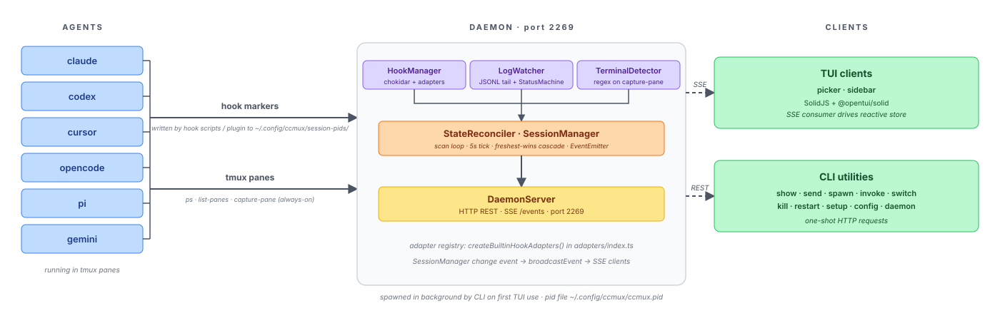

<div align="center">
  <h1>
    <picture>
      <source media="(prefers-color-scheme: dark)" srcset="assets/logo-dark.svg">
      
    </picture>
    <br>ccmux
  </h1>
</div>

<p align="center">
  <strong>Run all your AI coding agents (Claude Code, Codex, Cursor, ...) in tmux: jump to the one that needs you, spawn them into worktrees, and hand work between them</strong>
</p>

<p align="center">
  
</p>

## ❓ Why?

When running multiple AI coding agent sessions across tmux panes, it's hard to keep track of which session is idle, which is waiting for permission, and which pane to switch to. `ccmux` solves this with a background daemon that monitors session activity and an interactive TUI that shows live session states at a glance.

It works with your existing tmux workflow. You don't change how you launch or run your agents; ccmux discovers what's already running in your panes, so as long as you're in tmux with a supported agent, it just works.

**Built-in support for:** Claude Code, Codex, Cursor, OpenCode, Pi, Antigravity, Copilot, Gemini CLI, plus [custom agent definitions](#-custom-agents) via config.

## ✨ Features

- 🎯 **Live Session States**: Every agent tracked as idle, working, or waiting (permission / plan approval / question), flagged the moment one needs you
- 🧩 **Multi-Agent**: Claude Code, Codex, Cursor, OpenCode, Pi, Antigravity, Copilot, Gemini CLI, plus custom agents via config
- 🔄 **Real-Time**: Background daemon streams state changes instantly over SSE, no polling, no refresh
- 👁️ **Live Preview**: Split-pane view of the selected session's pane content
- ⚡ **Act in Place**: Tab into the preview to approve, answer, or type, keys go straight to that pane
- 🔔 **Actionable Notifications**: Approve, deny, or reply to a waiting agent straight from the desktop notification
- 🪟 **Sidebar Mode**: Compact always-visible session rail docked beside your working panes
- 🔍 **Fuzzy Search**: Fuzzy-match sessions by project, branch, or path; substring-match any recent prompt, captured pane content, and on-demand live transcripts
- 📂 **Session Grouping**: Collapsible project groups with reordering and pinning
- 🌿 **Git & PR Aware**: Branch and worktree detection, open PRs with live CI and review status
- 🌱 **Worktree Workflow**: Spawn or fork sessions into fresh git worktrees, move uncommitted changes out of a dirty checkout, and prune leftovers from the Worktrees panel
- 📝 **Diff Review**: Press <kbd>d</kbd> to review a session's working-tree diff with [hunk](https://github.com/modem-dev/hunk), right in the pane, or <kbd>D</kbd> for everything the branch changed since it forked
- 🤖 **Background Agents & Subagents**: Claude Code background agents get rows too; running subagents show as `agents` with a live list in the preview
- 🎛️ **Session Control**: Spawn, fork, kill, and restart sessions from the TUI; `ccmux invoke` for scripted one-shot agent turns
- 🤝 **Session Handoff**: Send a session's last response to another agent, from the CLI, the row menu, or agent-to-agent via the bundled relay skill
- ⌨️ **Keyboard-First, Mouse-Friendly**: Vim keys and number jumps, plus click-to-switch and right-click context actions

## 📦 Installation

### Prerequisites

- [tmux](https://github.com/tmux/tmux) with active sessions running AI coding agents
- git 2.31 or newer (for branch and worktree detection; ccmux still works without it, just without that info)

### Homebrew

```sh
brew install epilande/tap/ccmux
ccmux setup
```

### From Source

Requires [Bun](https://bun.sh).

```bash
git clone https://github.com/epilande/ccmux.git
cd ccmux
bun install
bun link
ccmux setup
```

`ccmux setup` installs agent hooks for authoritative session matching. ccmux works without it, but it's recommended; see [Session Matching with Hooks](#-session-matching-with-hooks). Bare `ccmux setup` only configures agents whose executable is found on PATH; use `ccmux setup --agent <name>` to install for a specific agent even if it isn't detected.

## 🚀 Quick Start

1. Start your AI coding sessions in tmux panes as usual
2. Launch the picker:
   ```bash
   ccmux
   ```
3. Navigate with <kbd>j</kbd>/<kbd>k</kbd>, press <kbd>Enter</kbd> to switch to a session

> [!TIP]
> Bind a tmux key so you can pop ccmux open from anywhere (add to `~/.tmux.conf`):
>
> ```tmux
> # Prefix + C-p: open ccmux in a centered popup
> bind-key C-p display-popup -E -w 80% -h 75% "ccmux"
>
> # Or skip the prefix entirely (Alt+p from any pane)
> bind-key -n M-p display-popup -E -w 80% -h 75% "ccmux"
> ```
>
> The picker exits after you select a session, so the popup closes itself and drops you straight into that pane. (`display-popup` requires tmux 3.2+.)

## 🎮 Usage

### CLI Commands

| Command                                     | Description                                                                                                                      |
| :------------------------------------------ | :------------------------------------------------------------------------------------------------------------------------------- |
| `ccmux`                                     | Launch interactive TUI picker (default)                                                                                          |
| `ccmux picker`                              | Launch TUI with options (`--preview`, `--icons <style>`)                                                                         |
| `ccmux picker --persistent`                 | Dashboard mode (stay open after switching sessions)                                                                              |
| `ccmux spawn [agent]`                       | Spawn a new agent session in a tmux pane                                                                                         |
| `ccmux invoke [agent] "prompt"`             | Run a single agent turn and write the response to stdout ([docs](docs/invoke.md))                                                |
| `ccmux invoke list`                         | List active and recently-finished invocations (`-j` for JSON)                                                                    |
| `ccmux invoke cancel <id>`                  | Cancel a running invocation by id (idempotent)                                                                                   |
| `ccmux invoke result <id>`                  | Print an invocation's full captured output (subprocess agents only)                                                              |
| `ccmux show`                                | List all active sessions                                                                                                         |
| `ccmux show --json`                         | Output sessions as JSON                                                                                                          |
| `ccmux status`                              | Show daemon and session overview                                                                                                 |
| `ccmux switch <id>`                         | Switch tmux client to a session's pane                                                                                           |
| `ccmux review [id]`                         | Review a session's diff with [hunk](https://github.com/modem-dev/hunk) (defaults to cwd)                                         |
| `ccmux kill <id>`                           | Kill a session's process                                                                                                         |
| `ccmux restart <id>`                        | Kill and resume a session                                                                                                        |
| `ccmux last <session-ref>`                  | Print a session's last response (`--turns <n>`, `--json`) ([docs](docs/handoff.md))                                              |
| `ccmux handoff <from> [to]`                 | Hand a session's last response to another session (`--turns`, `--note`, `--spawn`, `--agent`, `--cwd`) ([docs](docs/handoff.md)) |
| `ccmux send <id> <text>`                    | Send text to a session's tmux pane (multiline pastes as one message; `--no-enter` skips submit)                                  |
| `ccmux send <id> --stdin`                   | Same, reading the text from stdin instead of argv                                                                                |
| `ccmux screen [id]`                         | Capture pane content                                                                                                             |
| `ccmux screen --grep <pattern>`             | Search across all session panes                                                                                                  |
| `ccmux dismiss <id>`                        | Remove a session from tracking                                                                                                   |
| `ccmux worktree list`                       | List every worktree of the repos ccmux knows about, plus the one you are in (`--repo <path>`)                                    |
| `ccmux worktree prune`                      | Remove worktrees whose work is finished (`--dry-run`, `--state`, `--repo <path>`)                                                |
| `ccmux daemon start\|stop\|restart\|status` | Manage the background daemon                                                                                                     |
| `ccmux config set <key> <value>`            | Set a preference                                                                                                                 |
| `ccmux config get <key>`                    | Get a single preference value                                                                                                    |
| `ccmux config list`                         | List all preferences                                                                                                             |
| `ccmux config themes`                       | List built-in themes (marks the active one)                                                                                      |
| `ccmux setup`                               | Install hooks for every supported agent found on PATH (Claude + Codex + Cursor + OpenCode + Pi + omp + Antigravity + Copilot)    |
| `ccmux setup --agent <name>`                | Limit install/uninstall/status to specific agent(s); forces install even if not found on PATH                                    |
| `ccmux setup --status`                      | Report install state without writing anything                                                                                    |
| `ccmux setup --uninstall`                   | Remove hooks (preserves user-owned hook entries)                                                                                 |
| `ccmux debug`                               | Diagnose session tracking discrepancies                                                                                          |
| `ccmux notify [message]`                    | Send a notification via the configured backend (bare: test message + diagnostics)                                                |
| `ccmux sidebar`                             | Launch narrow sidebar TUI (no preview/footer)                                                                                    |
| `ccmux sidebar --toggle`                    | Smart toggle: spawn/kill sidebars in every window across all tmux sessions                                                       |

The daemon starts automatically the first time you run a ccmux command (picker, show, invoke, etc.). It runs on `127.0.0.1:2269` and provides both a REST API and SSE event stream.

### Preview Pane

Press <kbd>P</kbd> to split the picker and preview the highlighted session's live pane content side by side. Press <kbd>Tab</kbd> to focus the preview and act in place: your keystrokes go straight to that agent's pane, so you can approve a permission, answer a question, or type a follow-up without ever leaving ccmux.

When the session has agents running, an **Agents** section lists each one with its runtime. Finished agents drop off the list.

https://github.com/user-attachments/assets/7e0d42b3-4e7b-43b8-8d06-72a2d69dd694

### Diff Review with Hunk

[hunk](https://github.com/modem-dev/hunk) is a terminal diff reviewer. With `hunk` on your `PATH`, press <kbd>d</kbd> in the picker to review the selected session's working-tree diff without leaving ccmux: the picker suspends, `hunk diff --watch` takes over the pane in the session's repository root, and the picker resumes when hunk exits. The same action is available from the row menu (<kbd>m</kbd>, or right-click). If the working tree has no changes, ccmux reports that instead of opening an empty review.

<kbd>Shift+D</kbd> reviews the other diff: everything the checkout has changed **since it forked**, not just what is uncommitted. That is the question worth asking about an agent working in a worktree, which commits as it goes and often has an empty working tree while the branch is the whole point. The base it compares against is whatever `ccmux spawn --worktree` recorded when it cut the branch, falling back to the merge-base with the repo's default branch for checkouts ccmux did not create. A checkout carrying no commits of its own beyond that base has no fork point to compare against, so <kbd>D</kbd> there shows the working tree, the same as <kbd>d</kbd>; a main checkout with unpushed commits does have one, and <kbd>D</kbd> shows those too.

To send review feedback back to the agent:

1. Press <kbd>c</kbd> in hunk to annotate a line, then <kbd>Ctrl+S</kbd> to save the note.
2. Add any other review notes and quit hunk.
3. Confirm **Send review comments** when the picker resumes. ccmux sends all captured notes, including short source snippets, to the agent as one prompt and stays in the picker so you can watch its status.

https://github.com/user-attachments/assets/4b729700-4903-44ff-8f1c-df4bc16b6f67

The offer relies on hunk's session JSON commands (`hunk session list` / `session comment list`). With an older hunk the review itself still works; the offer just doesn't appear.

The `reviewHandback` preference controls what happens when hunk exits:

- `confirm` (default) asks before sending the prompt.
- `auto` sends and submits the prompt immediately without a dialog.
- `fill` pastes the prompt into the agent's composer without submitting it. The text remains there until you jump to the session and submit or edit it; a later send or invoke may find it prepended.

The review also runs from the CLI:

```bash
ccmux review          # Review the current directory's repository
ccmux review <id>     # Review a session's repository by id
```

Install hunk with `brew install hunk`. The <kbd>d</kbd> footer hint and help entry appear only when hunk is detected on `PATH` at launch.

### Sidebar Mode

A compact, always-visible session list that lives alongside your working panes. No preview panel, no footer, just status icons and project names.

<p align="center">
  
</p>

```bash
ccmux sidebar --toggle                  # Toggle sidebars in all tmux windows
ccmux sidebar --toggle --width 40       # Custom width (default: 30)
ccmux sidebar --toggle --position right # Right side (default: left)
ccmux sidebar --resize --width 30       # Snap every existing sidebar pane to <width>
```

The smart toggle fills gaps when some windows are missing sidebars, and kills all sidebars when every window already has one. New windows automatically get a sidebar, and sidebars snap back to their configured width when a window is resized.

Configure defaults so `--toggle` uses your preferred layout:

```bash
ccmux config set sidebar.width 40
ccmux config set sidebar.position right
```

**Suggested tmux keybinding** (add to `~/.tmux.conf`):

```tmux
bind-key S run-shell "ccmux sidebar --toggle"
```

### Notifications

Desktop notifications on `waiting`/`finished` transitions, disabled by default. When a session needs permission, or has a plan waiting for approval, the banner carries **Approve** / **Deny** buttons; permission, plan, question, and "finished" notifications also carry an inline **Reply** field, so you can answer, redirect, or send the next instruction without switching to its pane. Focusing a session's pane clears its notification.

|                                                                               **Permission → Approve / Deny**                                                                                |                                                                        **Question → inline Reply**                                                                         |
| :------------------------------------------------------------------------------------------------------------------------------------------------------------------------------------------: | :------------------------------------------------------------------------------------------------------------------------------------------------------------------------: |
|  |  |

```bash
ccmux config set notifications.enabled true
ccmux notify   # sends a test notification and prints setup diagnostics
```

Actionable Approve/Deny buttons work for **Claude Code**, **OpenCode**, **Codex**, **Cursor**, **Gemini CLI**, **Antigravity**, **Copilot**, and **oh-my-pi**; Pi has no tool-approval pause, so it never raises a waiting notification. Inline **Reply** on waiting-state notifications (permission, plan, question) is Claude Code only; Reply on **finished** notifications works for every built-in agent. A reply the agent's composer would misread as a command (e.g. leading `!` or `/`) is refused instead of typed, and the text comes back in a follow-up notification so it isn't lost. Approve/Deny work on macOS and Linux; inline reply needs a notification server that advertises it (always on macOS, varies on Linux).

For OpenCode, one server can host several sessions folded into a single row, so when more than one is waiting at once the buttons are withheld (the keystroke could land on the wrong session's dialog) and the notification is delivered informational-only.

**macOS:** the buttons, ccmux's own name and icon, per-session grouping, and retraction come from a helper app Homebrew installs alongside ccmux, so `brew install epilande/tap/ccmux` for the full experience. Source installs fall back to `osascript` (posts as Script Editor, silenced by Focus / Do Not Disturb, no buttons or reply). macOS never shows a permission dialog for a CLI-launched app, so grant it once by hand: run `ccmux notify` and follow the printed steps (open the settings deep link, find **ccmux**, enable **Allow notifications**, set **Alert Style** to **Persistent**), then re-run `ccmux notify` to confirm.

**Linux:** `dbus` grouping, click-to-jump, and Approve/Deny are native (no extra binary); inline reply appears only when the server advertises it. A headless daemon (SSH, systemd) needs `DBUS_SESSION_BUS_ADDRESS`, plus `DISPLAY` for the `notify-send` fallback.

Configure further with `ccmux config set notifications.<key> <value>`, or edit `~/.config/ccmux/ccmux.json` directly:

```jsonc
{
  "notifications": {
    "enabled": true, // default false (opt-in)
    "events": ["waiting", "finished"], // default both
    "sound": "Glass", // false (default) | true (platform default sound) | macOS sound name
    "delayMs": 1000, // debounce for "finished" only; "waiting" always fires immediately
    "backend": "auto", // "auto" | "ccmux-notifier" | "osascript" | "notify-send" | "dbus" | "osc" | "command"
    "command": "ntfy publish agents \"$CCMUX_TITLE: $CCMUX_BODY\"", // used when backend = "command"
  },
}
```

`backend: "auto"` picks `ccmux-notifier` (else `osascript`) on macOS, and D-Bus (else `notify-send`) on Linux. `command` runs your own shell command with `CCMUX_*` env set (`EVENT`, `SESSION_ID`, `AGENT`, `PROJECT`, `BRANCH`, `TITLE`, `SUBTITLE`, `BODY`, `PANE`), for ntfy, Pushover, and the like. `CCMUX_BODY` is the complete text (the event line plus any context), so a script reading only it still gets something meaningful; `CCMUX_SUBTITLE` is the bare event line on its own for structured consumers.

The `osc` backend delivers notifications through the terminal stream instead of a desktop API, for daemons running on a remote box; see [Remote / SSH](#-remote--ssh).

> [!NOTE]
> **Approve/Deny only send the mapped keystroke** to that session's pane (for Claude, the same key you'd press yourself). **Approve on a plan** picks "manually approve edits" (edits stay gated), never Claude's auto-accept mode. **Reply on a permission or plan notification denies the pending tool/plan** and sends your text as the next message (it cancels the prompt first, then types). If the session moved on since the notification fired, the press sends nothing and you get a fresh "state changed" notification instead; dismissing a notification never approves anything.

The keystrokes behind the buttons come from a per-agent `notificationActions` map, overridable per [Custom Agents](#-custom-agents).

### Search Mode

Press <kbd>/</kbd> to filter the list as you type. ccmux searches several sources at once and highlights why each row matched:

- **Metadata** (project, branch, path) matches fuzzily, so `ccmx` still finds `ccmux`.
- **Recent prompts, captured pane content, and live transcripts** match by substring, so a content word matches only where it actually appears.

Prompts come from the daemon's in-memory index, which keeps the most recent prompts per session and is tail-bounded after a daemon restart (only recent prompts are re-read from disk). Transcript search closes that gap: it reads each session's transcript file on demand and covers the full session history, including assistant replies (Claude and Codex).

Three toggles control what gets scanned: `searchPaneContent`, `searchPaneLines`, and `searchTranscript` (see [Configuration](#-configuration)).

### Spawning Sessions


Launch new agent sessions directly from the CLI:

```bash
ccmux spawn                                                        # Spawn claude (default) in a new tmux window
ccmux spawn codex                                                  # Spawn a specific agent
ccmux spawn --split                                                # Split current pane instead of new window
ccmux spawn --split h                                              # Split left/right ('v' is the stacked default)
ccmux spawn --target %12                                           # Split (or place the window next to) a specific pane
ccmux spawn --detach                                               # Don't switch to the new pane
ccmux spawn --cwd ~/proj                                           # Set working directory
ccmux spawn --resume <id>                                          # Resume an existing session
ccmux spawn --fork <id>                                            # Branch an existing session into a new one
ccmux spawn --prompt "fix the tests"                               # Send an initial prompt
ccmux spawn --worktree --prompt "fix flicker"                      # Spawn into a git worktree (name derived from the prompt)
ccmux spawn --worktree fix-flicker                                 # Spawn into a named worktree, creating it if needed
ccmux spawn --worktree --base develop --prompt "fix flicker"       # Branch the new worktree from develop
ccmux spawn --worktree fix-flicker --with-changes                  # Move this checkout's uncommitted work into it
ccmux spawn --worktree fix-flicker --with-changes --untracked copy # Untracked files land in both
ccmux spawn --fork <id> --worktree                                 # Fork into a fresh worktree off the source's branch
ccmux spawn --pr 154                                               # Check that PR out in a worktree, on its own branch
ccmux spawn --issue 150                                            # New worktree named after the issue, prompt seeded
```

Split directions use tmux's own vocabulary: `h` puts the new pane beside the
old one, `v` stacks it below. Run inside tmux, `ccmux spawn` uses the pane you
ran it from, so the new pane or window lands in your session rather than
wherever the daemon happens to consider "current". A new window is appended at
the end of your session, which leaves every existing window index alone; pass
`--target <pane-id>` to insert one directly after that pane's window instead
(tmux renumbers the windows after it), or `--target none` to let tmux place it.

`--target` accepts any pane on the server, including one in a _different_ tmux
session: ccmux creates the pane there and moves your client over to it, the
same jump `ccmux switch` makes. Pass `--detach` to leave your view where it is.
That jump needs a client of its own to move, so it only happens when you run
`ccmux spawn` from inside the session you are attached to; run from outside
tmux, or from a detached session, it creates the pane without switching (use
`ccmux switch` afterwards).

`--prompt` starts the agent interactively with the prompt already submitted.
It is supported for the agents whose interactive-with-prompt invocation ccmux
has verified; for anything else (including custom agents) ccmux refuses the
spawn rather than guessing a flag, and you can teach it the right shape with
`promptCommand` in your agent config.

`--worktree [name]` spawns the agent into a git worktree at
`<main>/.claude/worktrees/<name>`, creating it first if it doesn't exist yet.
An explicit name is create-or-open: spawning into the same name again reuses
that worktree rather than failing. Without a name, ccmux derives one from
`--prompt`'s opening words; a derived name that collides with an existing
worktree gets a numeric suffix (`-2`, `-3`, ...) instead of reusing it, since
two different prompts landing in the same worktree would silently merge
unrelated work. `--base <ref>` sets what the new branch is cut from,
defaulting to the main checkout's current branch.

Creating a worktree also adds `**/.claude/worktrees/` to the hosting repo's
`.git/info/exclude` (the same line Claude Code writes, and the same file —
local to your clone, never `.gitignore`), so the worktrees don't show up as
untracked work in the checkout that hosts them. It is added once, only if git
isn't already ignoring that path, and nothing else in the file is touched.

### Spawning on a PR or an Issue

`--pr <n>` resolves the pull request with `gh`, fetches `pull/<n>/head`, and
spawns the agent into a worktree checked out on the PR's **own branch**, set
up to track it the way `gh pr checkout` would, including a fork PR, whose
branch is pointed at the fork's clone URL so `git push` updates the PR instead
of failing. The worktree is named `pr-<n>-<head-ref>`, which deliberately
never collides with the `pr-<n>` directories Claude Code creates for its own
fetch-only PR checkouts. `--base` is refused here: the PR's head is the start
point. ccmux records `origin/<base>` as the branch's review base, so <kbd>d</kbd>
in the picker shows the PR's actual diff.

`--issue <n>` is an ordinary spawn-from-base worktree named `issue-<n>-<title>`;
`--base` works as usual.

Both seed the agent's opening prompt with the title and URL, and your own
`--prompt` is appended after it. Both refuse rather than guess: a PR that is
not open, an issue that is closed, a PR whose branch is already checked out in
another worktree (ccmux names it), and a same-named local branch that is not
that PR (a branch counts as the PR's only when its `merge` *and* `remote` config
both already point at it, so a fork PR cannot ride in on a name collision with
one of your origin-tracking branches). The remote is compared as a repository,
not as text, so a branch you set up yourself with `git remote add fork <url>`
and `git checkout -b <branch> fork/<branch>` is recognized as the PR's. A local
branch that *is* the PR is fast-forwarded, never force-updated. If it has
diverged, ccmux leaves it alone and says so.

ccmux fetches the PR from `origin`, while `gh` resolves the number through its
own repo selection (`gh repo set-default`, `GH_REPO`, a fork clone's upstream).
If those name different repositories, ccmux refuses and names both rather than
checking out a same-numbered PR from the wrong repo.

### Moving Uncommitted Changes

`--with-changes` relocates the checkout's uncommitted work into the worktree
it creates, so the new agent starts on top of it and the checkout you left is
clean:

```bash
ccmux spawn --worktree fix-flicker --with-changes
```

**Move changes** in a session's context menu does the same thing from the
picker. It only appears for a row whose checkout is actually dirty, and it
opens the new-session dialog already set to move: the destination is locked to
a new worktree, an **Untracked** row appears, and the name and prompt stay
editable.


The picker holds any outcome that needs your attention until a keypress: a
failure that parked your work in a stash (with the command to get it back), a
move that completed but could not drop its own backup entry, a staged/unstaged
split it could not preserve, or a spawn that failed after the changes had
already moved (naming the worktree they moved into). Only refusals that
changed nothing (a name already taken, nothing to move) are a passing toast,
since the fields to fix them are still in front of you. The sidebar toasts
what a clean move did; the picker jumps straight into the new pane, as it does
for every other spawn.

Untracked files move by default (leaving them behind would strand the work
you are relocating). `--untracked copy` puts them in both places,
`--untracked leave` keeps them where they are. Gitignored files are never
moved or copied in any mode; `worktree.symlinkDirectories` and
`.worktreeinclude` cover those.

The move is stash-first: your changes are stashed out of the checkout, the
worktree is created, the entry is applied into it, and only then is the entry
dropped. If anything fails before the entry is dropped, your checkout is put
back as it was, and the stash entry holding your work is reported by sha
whether or not the restore succeeded.

Staged and unstaged changes arrive as you left them where git allows it; if
the split cannot be preserved, everything still moves and you are told to
re-run `git add`.

ccmux refuses to run at all while a merge, rebase, cherry-pick, revert, or
bisect is in progress, and refuses a worktree name that already exists — a
move needs a fresh worktree, because rolling one back would take a checkout
it did not create.

### Forking Sessions

Fork starts a second session that continues an existing conversation's
history, in a pane beside the original, and leaves the original running and
untouched. (A source with no pane of its own gets a new window instead.)

<kbd>F</kbd> in the picker, or **Fork** in a session's context menu, opens the
new-session dialog over the row; Enter on it forks straight away, into a pane
beside the source's own. `ccmux spawn --fork <session-id>` forks the same way
but places the result like every other `ccmux spawn`, relative to the pane you
run it from. Either way the new pane is tracked like any other session, with
its own row, state and id.


The fork starts in the source's directory by default. `--cwd` elsewhere is
honored, since the fork resumes the source's transcript by path rather than by
looking a session id up under the current directory.

`--worktree` goes one further and creates the destination, so the two sessions
edit their own checkouts instead of one. The worktree is named after the branch
the source is on (`<branch>-fork`, numbered `-2`, `-3` if that name is taken)
and cut from it, so the fork continues on the history its conversation was
written against. Name it yourself with `--worktree <name>` or pick the ref with
`--base`. `--with-changes` is refused on a fork: the original session is still
running in the checkout those changes would be moved out of.

The picker's version of that is the **Where** row in the dialog <kbd>F</kbd>
opens. It starts on **This checkout**, so an untouched dialog is the plain fork
beside the original; move it to **New worktree** and a **Name** row appears,
previewing the `<branch>-fork` the daemon would derive and taking one of your
own instead. A **Source** row names the conversation being continued;
everything else comes off the row. Where the source is not in a git repository
the choice is locked to its own checkout, since there is nowhere for a linked
one to go.

Fork needs two things, and the picker hides the action when either is missing:
the agent has to declare how it forks (`forkCommand`), and ccmux has to know
which conversation the pane holds. For most agents that knowledge comes from
hooks, so run `ccmux setup` if the action isn't offered.
Today **Claude Code** is the only agent that ships a fork command, because it
is the only one whose behavior when resuming a still-running session has been
verified. Adding another is one config line once you have checked it yourself
(see [docs/agent-adapters.md](docs/agent-adapters.md#forking-a-session)).

### Worktrees Panel

After a branch is merged (and auto-deleted on GitHub), three leftovers stay on your machine: the worktree directory, the local branch, and often a tmux pane with a finished agent in it.

<kbd>W</kbd> in the picker (or `Worktrees` on a group header) opens the Worktrees panel: every worktree of every repo in scope, main checkout first, with its branch, ahead/behind, uncommitted counts, open PR, and the agent living in it. <kbd>Enter</kbd> jumps to that agent, or starts one in a worktree that has none. <kbd>Tab</kbd> widens from the selected row's repo to all of them, <kbd>y</kbd> copies a path, and <kbd>d</kbd> reviews what the branch changed since it left its base (not just what is uncommitted, which is what <kbd>d</kbd> on a session row shows).

The panel has a second view: <kbd>l</kbd> switches to **Pull Requests**, every open PR of the repos in scope, with its branch, author, review state and checks, and the worktree it is already checked out in where there is one. <kbd>Enter</kbd> there cuts a worktree from the PR (or jumps to the agent already in it), <kbd>o</kbd> opens it on GitHub, and <kbd>h</kbd> goes back to the worktrees. The two axes are independent: <kbd>Tab</kbd> still scopes either view to one repo or all of them, and the tab line under the title names both views with the live PR count.

https://github.com/user-attachments/assets/cc25199b-f563-4cda-8b59-6e95c449a94a

The panel loads in two passes: the list paints immediately from local git state, then the prune classification (which fetches and asks GitHub) merges in and sinks the finished worktrees to the bottom of their group. Those, and only those, become selectable for removal, showing why each one is removable. <kbd>Space</kbd> selects a row, and <kbd>x</kbd> removes what you selected after a confirmation that spells out what goes with it; on a single clean removable row, <kbd>x</kbd> with nothing selected takes that row. `ccmux worktree prune` runs the same classification from the command line:

| Reason           | Meaning                                                                |
| :--------------- | :--------------------------------------------------------------------- |
| `PR merged`      | GitHub says the branch's PR was merged (survives squash/rebase merges) |
| `merged locally` | The branch tip is an ancestor of the default branch                    |
| `upstream gone`  | The branch had an upstream and it's gone after a `fetch --prune`       |
| `PR closed`      | The PR was closed without merging; the branch is kept                  |

Removing a worktree stops its agent (SIGTERM, escalating to SIGKILL if it does not exit) as a backstop, since a worktree with a bound live session is never offered in the first place, closes the leftover pane, deletes the directory, attempts to delete the local branch, prunes git's metadata, and drops the directory's entry from `~/.claude.json`. A worktree whose agent still won't die even after SIGKILL is refused rather than deleted, so nothing is removed out from under a process that may still be writing to it. Branch deletion follows the evidence rather than the reason: a merged PR is force-deleted (`git branch -D`, since a squash merge leaves the tip unmerged by git's definition), `merged locally` and `upstream gone` use the safe `git branch -d` and report a refusal if git says the branch still holds unmerged work, and `PR closed` keeps the branch entirely.

Safety rules, in short: a worktree with **any** bound session, working, idle, or waiting, is never offered, a branch still sitting on a base's tip is never classified as merged, a worktree whose PR state cannot be established (`gh` missing, logged out, offline, or pointed at a host it does not recognize) is skipped with the reason shown rather than treated as having no PR, nothing is pre-selected, dirty worktrees (uncommitted or untracked changes) need their own <kbd>D</kbd> opt-in on top of being selected and are re-checked immediately before deletion, a pane still working inside the worktree when the removal runs blocks that one removal (an editor counts as work; a bare shell left sitting there does not, and neither does a ccmux picker or sidebar), a `worktree.symlinkDirectories` symlink does not count as dirty (it is setup, not your work), gitignored files that would be deleted are surfaced before you confirm (the CLI lists them, the picker shows a count with up to two names on the row), and the main checkout is never a candidate.

Each directory is renamed to a `.ccmux-trash-<name>-<timestamp>` sibling before being deleted, so the path frees immediately and the contents survive for the length of the run. If ccmux is interrupted mid-run, look for that directory next to where the worktree was: `mv .ccmux-trash-<name>-<timestamp> <name>` restores it, and `git worktree repair <name>` re-links it to the repo.

```bash
ccmux worktree prune             # Interactive confirm list
ccmux worktree prune --dry-run   # Show what would go, change nothing
ccmux worktree prune --state     # Also drop agent state entries (see below)
ccmux worktree prune --repo ~/p  # Limit to one repository
```

`--state` removes `~/.claude.json` entries for **any** recorded directory that does not exist right now, not only former worktrees, so an ordinary repo you have not checked out will be dropped too. Entries whose parent directory is also missing are skipped, which keeps an unmounted external drive or a disconnected network share from taking every project on it with them. The removed paths are printed, and the file is copied to `~/.claude.json.ccmux-backup-<timestamp>-<pid>` first (the newest three are kept).

There is no `--yes` and no automatic mode; removals are always confirmed interactively. `--dry-run` changes nothing on disk, though it still runs `git fetch --prune` per repo, which is what makes the `upstream gone` signal visible and does update remote-tracking refs.

### Programmatic Invocation

`ccmux invoke` runs a single agent turn and writes the response to stdout, so you can use real agents in shell pipelines and scripts. See [`docs/invoke.md`](docs/invoke.md) for the full reference.

```bash
ccmux invoke claude "say hi in one word"
echo "what is 2 + 2" | ccmux invoke claude
git diff main | ccmux invoke claude "Review this diff"
```

Claude runs interactively in a dedicated tmux session and returns clean text parsed from the transcript JSONL. Codex, Cursor, OpenCode, Pi, oh-my-pi, Antigravity, Copilot, and Gemini run as non-interactive subprocesses (`codex exec -o`, `cursor-agent --print`, `opencode run --format json`, `pi -p`, `omp -p`, `agy -p`, `copilot -p --allow-all-tools`, `gemini -p`) and return the agent's clean response text.

For orchestration, name an invocation with `--id <id>`, then use `ccmux invoke list`, `ccmux invoke cancel <id>`, and `ccmux invoke result <id>` to watch, cancel, or read its full captured output by that id. See [`docs/invoke.md`](docs/invoke.md#fire-and-poll---id-list-cancel-result) for the fire-and-poll reference.

### Reading and Handing Off Between Sessions

`ccmux last` prints a session's last response; `ccmux handoff` moves it into another session without the text passing through whoever ran the command. See [`docs/handoff.md`](docs/handoff.md) for the full reference.

```bash
ccmux last codex                       # print the last response, pipeable
ccmux last codex --turns 3             # widen to the last three exchanges
ccmux last <id> | pbcopy

ccmux handoff codex claude --note "this is the failing test, take it from here"
ccmux handoff self codex               # an agent handing off its own conclusion
ccmux handoff self --spawn             # ...into a session that does not exist yet
```

Both take a **session reference**, not just an id: a session id, `%pane`, `session:window.pane`, `self`, an agent type, or a project name. Fuzzy references are scoped by where you are sitting (same window, then same tmux session, then everything), and an ambiguous one is refused with the candidate list rather than guessed at.

https://github.com/user-attachments/assets/9d73a646-a3cf-4da8-9c8c-2cdb2798e9e2

A handoff arrives with a provenance header naming the source session, agent, directory, branch, and time, and is **only ever typed into an idle composer**: a target that is mid-turn gets it queued and delivered when the turn ends, and a target with a pending prompt is refused.

In the picker, the row menu's **Copy** opens a small dialog asking how much to take: it starts on the last response, so <kbd>Enter</kbd> copies that straight to your clipboard, while <kbd>j</kbd>/<kbd>k</kbd> or a digit counts up to 20 turns (which brings your own prompts along, formatted exactly as `ccmux last` prints them). **Hand off** starts a pick-target mode: the session list itself becomes the target picker, <kbd>j</kbd>/<kbd>k</kbd> move, and <kbd>Enter</kbd> (or a click) opens a dialog asking how many turns to send and offering a one-line note for the receiving agent. <kbd>Enter</kbd> there sends and <kbd>Esc</kbd> cancels the whole handoff. A queued handoff shows a **⇄** badge on the target row until it lands.

### Agent Skills

This repo ships two [Agent Skills](https://agentskills.io) for your coding agent: `dispatch` teaches it to orchestrate other agents through `ccmux invoke` (firing, fan-out, joining, cancelling, and reading worker output), and `relay` teaches it to read a peer session's output with `ccmux last` and move it into another session with `ccmux handoff`. For Claude Code they install together as one plugin (this repo doubles as a plugin marketplace):

```
/plugin marketplace add epilande/ccmux
/plugin install ccmux@ccmux
```

Other skills-capable agents (Codex, Cursor, OpenCode, and others) can use the same skills by copying them into their skills directory. Both are additive glue for the ccmux CLI, which must be installed and on your `PATH`. See [`plugins/ccmux/README.md`](plugins/ccmux/README.md) for details.

## ⌨️ Keyboard Controls

| Action                | Key                                                                                | Description                                                                                                            |
| :-------------------- | :--------------------------------------------------------------------------------- | :--------------------------------------------------------------------------------------------------------------------- |
| Navigate              | <kbd>j</kbd> / <kbd>k</kbd> or <kbd>↑</kbd> / <kbd>↓</kbd>                         | Move through session list                                                                                              |
| Jump to first/last    | <kbd>g</kbd><kbd>g</kbd> / <kbd>G</kbd>                                            | Go to top / bottom                                                                                                     |
| Jump to session       | <kbd>1</kbd>–<kbd>9</kbd>                                                          | Switch directly to session N                                                                                           |
| Switch to session     | <kbd>Enter</kbd>                                                                   | Switch tmux to the selected pane                                                                                       |
| Row menu              | <kbd>m</kbd>                                                                       | Open the selected row's (or group header's) context menu; <kbd>j</kbd>/<kbd>k</kbd> to move, <kbd>Enter</kbd> to run   |
| Copy last response    | <kbd>y</kbd>                                                                       | Open the Copy dialog for the selected row: last response, or up to 20 turns                                            |
| New session           | <kbd>n</kbd>                                                                       | Open the new-session dialog (agent, placement, prompt, worktree + name; directory derived from the selected row)       |
| Search                | <kbd>/</kbd>                                                                       | Enter fuzzy search mode                                                                                                |
| Toggle preview        | <kbd>P</kbd>                                                                       | Show/hide the preview panel                                                                                            |
| Scroll preview        | <kbd>Ctrl+D</kbd> / <kbd>Ctrl+U</kbd>                                              | Half-page scroll in preview                                                                                            |
| Resize preview        | <kbd>Alt+H</kbd> / <kbd>Alt+L</kbd>                                                | Increase/decrease preview width                                                                                        |
| Focus preview         | <kbd>Tab</kbd>                                                                     | Send keys directly to tmux pane                                                                                        |
| Restart session       | <kbd>r</kbd>                                                                       | Kill and resume the selected session                                                                                   |
| Reconnect             | <kbd>R</kbd>                                                                       | Reconnect to the daemon SSE stream                                                                                     |
| Kill session          | <kbd>x</kbd>                                                                       | Kill the selected session's process                                                                                    |
| Kill all              | <kbd>X</kbd>                                                                       | Kill all tracked sessions                                                                                              |
| Fork session          | <kbd>F</kbd>                                                                       | Branch the conversation into a pane of its own, leaving the original running                                           |
| Worktrees             | <kbd>W</kbd>                                                                       | Open the Worktrees panel: jump, start an agent, copy a path, review, or prune (multi-select, confirmation)             |
| Review and hand back  | <kbd>d</kbd> / <kbd>D</kbd>                                                        | Review with [hunk](https://github.com/modem-dev/hunk), then offer to send notes to the agent (requires `hunk` on PATH) |
| Collapse/expand       | <kbd>h</kbd> / <kbd>l</kbd> or <kbd>Space</kbd>                                    | Toggle group collapsed state                                                                                           |
| Move group            | <kbd>J</kbd> / <kbd>K</kbd>                                                        | Reorder group down / up (persisted)                                                                                    |
| Move group top/bottom | <kbd><</kbd> / <kbd>></kbd>                                                        | Pin group to top / bottom                                                                                              |
| Collapse/expand all   | <kbd>z</kbd><kbd>M</kbd> / <kbd>z</kbd><kbd>R</kbd> or <kbd>-</kbd> / <kbd>=</kbd> | Collapse or expand all groups                                                                                          |
| Hide idle             | <kbd>f</kbd>                                                                       | Toggle hiding idle sessions                                                                                            |
| Cycle prompt          | <kbd>p</kbd>                                                                       | Prompt display: inline → own row → off                                                                                 |
| Cycle group-by        | <kbd>b</kbd>                                                                       | Cycle through group-by modes                                                                                           |
| Help                  | <kbd>?</kbd>                                                                       | Show keyboard shortcuts overlay                                                                                        |
| Quit                  | <kbd>q</kbd> / <kbd>Esc</kbd>                                                      | Exit the picker                                                                                                        |

<details>
<summary><strong>New session dialog keys</strong></summary>

Opened with <kbd>n</kbd>, or from the row menu (<kbd>m</kbd>, or right-click) on a session row or a group header. Every field has a default, so <kbd>n</kbd> <kbd>Enter</kbd> spawns straight away.

| Action              | Key                                                        |
| :------------------ | :--------------------------------------------------------- |
| Next / prev field   | <kbd>Tab</kbd> / <kbd>Shift+Tab</kbd>                      |
| Move within a field | <kbd>j</kbd> / <kbd>k</kbd> or <kbd>↑</kbd> / <kbd>↓</kbd> |
| Pick by number      | <kbd>1</kbd>–<kbd>9</kbd>                                  |
| Where it runs       | <kbd>1</kbd> This checkout / <kbd>2</kbd> New worktree     |
| Name the worktree   | Type on the **Name** row (worktree destinations only)      |
| Spawn               | <kbd>Enter</kbd>                                           |
| Cancel              | <kbd>Esc</kbd>                                             |

Movement and number keys apply to the focused field, so <kbd>2</kbd> picks the second agent on the Agent field and the second placement on the Placement field. In the Prompt and Name fields every key is text, so <kbd>↑</kbd> / <kbd>↓</kbd> (or <kbd>Ctrl</kbd>+<kbd>P</kbd> / <kbd>Ctrl</kbd>+<kbd>N</kbd>) move between fields there instead.

**Where** picks between this checkout and a new git worktree, whose branch is cut from the main checkout's current branch. Choosing a different base ref is CLI-only (`ccmux spawn --worktree --base <ref>`). Moving changes is the one exception: its worktree is cut from the HEAD of the checkout the changes came out of, so the work lands on the history it was written against rather than on whatever the main checkout happens to be on.

Choosing the worktree adds a **Name** row showing the name it would create, derived from the prompt and updated as you type. Type over it to name the worktree yourself; clear the field to hand the name back to the prompt. The two are not the same request: a derived name that collides with an existing worktree is numbered (`-2`), which is what the row's `auto · -2 if taken` note means, while a name you typed opens that worktree if it is already there. Names are slugified the way `ccmux spawn --worktree <name>` slugifies them, so `Fix Sidebar Flicker` becomes `fix-sidebar-flicker`, and a name is enough on its own — a worktree no longer needs a prompt to be spawnable. A name with nothing to slugify (punctuation, a non-Latin script) is refused when you confirm rather than quietly replaced by the derived one.

Opened from **Move changes**, the same dialog runs in move mode: the title says so, **Where** is locked to the new worktree (there is nowhere else the changes can go), the same editable **Name** row is there, and an **Untracked** field appears — <kbd>1</kbd> move, <kbd>2</kbd> copy to both, <kbd>3</kbd> leave here. <kbd>Tab</kbd> skips the locked field. See [Moving Uncommitted Changes](#moving-uncommitted-changes).

Opened with <kbd>F</kbd> or from **Fork** it runs in fork mode: the title says so, a **Source** row names the conversation being continued, and the **Agent** and **Prompt** rows are gone — a fork continues the source's agent and its history, so there is nothing to pick and no first message to write. **Where** starts on this checkout and **Placement** on a split, so <kbd>F</kbd> <kbd>Enter</kbd> forks straight into a pane beside the original. Choose the new worktree instead and the **Name** row appears, previewing `<branch>-fork`; where no name can be derived (the source is on a detached HEAD, or on a branch with nothing in it to slugify) the row asks you to type one rather than promising an automatic name. A source outside a git repository has the choice locked to its own checkout. See [Forking Sessions](#forking-sessions).

In a pane too short for every row, the dialog drops what it can spare before anything you act on — the mode note (a move's, or a fork's **Source** row), then the blank line, then the option lists become scrolling windows, and the directory row last; below the height its fields need, it says how many rows it wants instead of drawing over itself, and the number keys go quiet while it does.

The working directory is derived, not typed: a session row uses that session's directory, a group header uses the group's, and no selection falls back to where the picker was launched. The picker jumps to the new pane, and a one-shot picker then closes while a `--persistent` board stays open; the sidebar spawns into the window's main area without stealing focus.

</details>

<details>
<summary><strong>Search mode keys</strong></summary>

| Action           | Key                                                                  |
| :--------------- | :------------------------------------------------------------------- |
| Navigate results | <kbd>↑</kbd> / <kbd>↓</kbd> or <kbd>Ctrl+N</kbd> / <kbd>Ctrl+P</kbd> |
| Select           | <kbd>Enter</kbd>                                                     |
| Cancel           | <kbd>Esc</kbd>                                                       |

</details>

<details>
<summary><strong>Preview focus mode</strong></summary>

When preview is focused (<kbd>Tab</kbd>), keystrokes are forwarded to the tmux pane. These keys still work:

| Action            | Key                                   |
| :---------------- | :------------------------------------ |
| Navigate sessions | <kbd>Ctrl+N</kbd> / <kbd>Ctrl+P</kbd> |
| Resize preview    | <kbd>Alt+H</kbd> / <kbd>Alt+L</kbd>   |
| Scroll preview    | <kbd>Ctrl+D</kbd> / <kbd>Ctrl+U</kbd> |
| Exit focus        | <kbd>Tab</kbd> / <kbd>Esc</kbd>       |

</details>

## ⚙️ Configuration

Preferences are stored in `~/.config/ccmux/ccmux.json` and can be managed with:

```bash
ccmux config set <key> <value>
ccmux config get <key>
ccmux config list
```

| Key                          | Values                                                                       | Default            | Description                                                                                                                        |
| :--------------------------- | :--------------------------------------------------------------------------- | :----------------- | :--------------------------------------------------------------------------------------------------------------------------------- |
| `iconStyle`                  | `dot`, `emoji`, `nerdfont`, `none`                                           | `dot`              | Status icon style                                                                                                                  |
| `theme`                      | `catppuccin-*`, `tokyo-night*`, `dracula`, `gruvbox-*`, `nord`, `rose-pine*` | `catppuccin-mocha` | TUI color theme (resolved at launch; see [Theme](#-theme))                                                                         |
| `showPreview`                | `true`, `false`                                                              | `false`            | Show preview panel on launch                                                                                                       |
| `previewWidth`               | `20`–`80`                                                                    | `40`               | Preview panel width (percentage)                                                                                                   |
| `command`                    | any non-blank string                                                         | `claude`           | CLI command used for session restart                                                                                               |
| `groupBy`                    | `project`, `cwd`, `session`, `window`, `none`                                | `project`          | How sessions are grouped in the TUI                                                                                                |
| `promptDisplay`              | `inline`, `row2`, `off`                                                      | `inline`           | Prompt display: inline on row 1, its own row, or hidden                                                                            |
| `backgroundAgents`           | `true`, `false`                                                              | `true`             | Show Claude background agents as rows (daemon restart required)                                                                    |
| `additionalClaudeConfigDirs` | array of paths                                                               | `[]`               | Additional Claude config dirs to watch (daemon restart required; see [Multiple Claude Config Dirs](#-multiple-claude-config-dirs)) |
| `searchPaneContent`          | `true`, `false`                                                              | `true`             | Include captured pane content in TUI search                                                                                        |
| `searchPaneLines`            | `10`–`500`                                                                   | `100`              | Lines of pane content scanned in TUI search                                                                                        |
| `searchTranscript`           | `true`, `false`                                                              | `true`             | Search live Claude/Codex transcripts (full history + assistant text) via the daemon                                                |
| `persistent`                 | `true`, `false`                                                              | `false`            | Keep picker open after switching sessions (dashboard mode)                                                                         |
| `reviewHandback`             | `confirm`, `auto`, `fill`                                                    | `confirm`          | After a hunk review, confirm delivery, send immediately, or fill the agent composer without submitting                             |
| `tmuxSocket`                 | socket path (`/...`) or label                                                | unset              | tmux server to track (daemon restart required; see [Non-default tmux Server](#-non-default-tmux-server))                           |
| `sidebar.width`              | `10`–`80`                                                                    | `30`               | Sidebar pane width in columns                                                                                                      |
| `sidebar.position`           | `left`, `right`                                                              | `left`             | Which side of the window to place the sidebar                                                                                      |

For how these search knobs interact, see [Search Mode](#search-mode).

### 📊 Column Configuration

Each session item has up to two rows (`row1`, `row2`), and each row has a `left` and `right` side. Each side is a comma-separated list of field entries. An entry is either `<field>` (use the field's default mode) or `<field>:<mode>` (override the mode).

```bash
ccmux config set columns.row1.left  "index,status:icon,project"
ccmux config set columns.row1.right "agent:short,pane,time"
ccmux config set columns.row2.left  "prompt"
ccmux config set columns.row2.right "branch"
```

Pass an empty string to clear a side: `ccmux config set columns.row2.left ""`.

| Field     | Modes                 | Default mode | Description                                                                              |
| :-------- | :-------------------- | :----------- | :--------------------------------------------------------------------------------------- |
| `index`   | —                     | —            | Row number (1–9)                                                                         |
| `status`  | `icon`/`short`/`full` | `icon`       | Status badge style                                                                       |
| `project` | `dirname`/`full`      | `dirname`    | Project path (basename or full); a worktree renders as `<repo>/<worktree>` in both modes |
| `agent`   | `short`/`full`        | `full`       | Agent name (2-char code or full label)                                                   |
| `version` | —                     | —            | Agent version                                                                            |
| `pane`    | —                     | —            | Tmux pane target (session:window.pane)                                                   |
| `time`    | —                     | —            | Relative time since last input                                                           |
| `prompt`  | —                     | —            | Last user prompt (truncated)                                                             |
| `cwd`     | —                     | —            | Working directory                                                                        |
| `branch`  | —                     | —            | Git branch, suffixed `+` in a worktree                                                   |
| `pr`      | `short`/`full`        | `full`       | Open PRs for the branch (`#25`/`PR #25`)                                                 |

The `project` cell reads `path:branch`, and a session running in a git worktree marks it twice: the branch gains a trailing `+` (also on the standalone `branch` column), and the path is replaced by `<repo>/<worktree>` — `ccmux/parking` rather than the `worktrees/parking` the directory happens to spell, so worktrees of different repos stay distinguishable. Both survive the `dirname` mode, since they are identity rather than path context; when the cell is too narrow for both, the repo yields before the worktree's own name does.

Defaults: `row1.left` is `index, status, project` (status badge widens icon→short→full as the terminal grows). `row1.right` cascades by breakpoint: just `pane` below `xs`, then `agent:short, pane` at `xs`, `agent:short, pane, time` at `sm`, and `agent:full, version, pane, time` at `md`+. The `prompt` and `pr` cells are configured on `row2`, but `promptDisplay` (default `inline`, cycled live by <kbd>p</kbd>) controls how they render: `inline` flattens them onto `row1` so each session stays a single line, `row2` gives the prompt its own line with `pr` at the right edge, and `off` hides both. Sessions with no prompt stay single-line in `inline` mode; in `row2` mode the second line still appears when another row-2 field (such as an open PR) has data.

Sidebar defaults differ to fit the narrow rail: `row1` is `status, project` with `pr:short, agent:short` on the right (PR stays visible even with the prompt hidden), and `row2` is `prompt` / `time` (a lone `time` never earns the row; it rides along when some other field has data). The 30-col rail has no room to inline, so the sidebar always uses the two-row layout (`inline` behaves like `row2`). Override these under the `sidebar.columns` key in `~/.config/ccmux/ccmux.json` (e.g. `"sidebar": { "columns": { "row2": { "left": ["pane"] } } }` to bring the pane target back).

The CLI's comma-separated form sets one mode per entry. To vary the layout by terminal width (responsive cascade), edit `~/.config/ccmux/ccmux.json` directly and use the `default`/`xs`/`sm`/`md`/`lg` keys on either a row side (whole array) or an entry's `mode`.

### 📐 Breakpoints

Named breakpoints control when responsive column layouts activate. A breakpoint value applies from that terminal width upward until a larger breakpoint overrides it.

| Name | Default width |
| :--- | :------------ |
| `xs` | 40            |
| `sm` | 60            |
| `md` | 80            |
| `lg` | 100           |

```bash
ccmux config set breakpoints.sm 55
ccmux config set breakpoints.lg 120
```

### 🎨 Theme

The TUI ships 14 built-in palettes across six families, resolved once at launch (no in-TUI toggle).

```bash
ccmux config themes                       # list built-ins, mark the active one
ccmux config set theme tokyo-night        # switch theme
```

| Theme                  | Background     |
| :--------------------- | :------------- |
| `catppuccin-mocha`     | dark (default) |
| `catppuccin-macchiato` | dark           |
| `catppuccin-frappe`    | dark           |
| `catppuccin-latte`     | light          |
| `tokyo-night`          | dark           |
| `tokyo-night-storm`    | dark           |
| `tokyo-night-day`      | light          |
| `dracula`              | dark           |
| `gruvbox-dark`         | dark           |
| `gruvbox-light`        | light          |
| `nord`                 | dark           |
| `rose-pine`            | dark           |
| `rose-pine-moon`       | dark           |
| `rose-pine-dawn`       | light          |

For per-key tweaks, set `theme` to an object in `~/.config/ccmux/ccmux.json`: a built-in `base` plus `colors` (the 14 semantic keys) and/or `ansi` (the 16 terminal colors used to render the preview), deep-merged over the base.

```json
{
  "theme": {
    "base": "catppuccin-mocha",
    "colors": { "red": "#ff5555" },
    "ansi": { "brightBlack": "#585b70" }
  }
}
```

An unknown base name falls back to the default theme; an invalid hex value or unknown override key is dropped and the base value is kept. Each emits a warning. Run `ccmux config themes` to inspect any problems with the current config.

> [!NOTE]
> ccmux paints no background fill, so theme colors sit on your terminal's own background. The light palettes (`catppuccin-latte`, `tokyo-night-day`, `gruvbox-light`, `rose-pine-dawn`) assume a light terminal; pair them with a light background. Every other palette assumes a dark one.

### 🗂️ Multiple Claude Config Dirs

Claude Code writes session transcripts to `$CLAUDE_CONFIG_DIR/projects` (default `~/.claude/projects`), so sessions from a second account (e.g. a personal login launched with `CLAUDE_CONFIG_DIR=~/.claude-personal`) land in a tree ccmux doesn't watch by default. List those dirs in `additionalClaudeConfigDirs` and a single daemon watches every `<dir>/projects` tree:

```bash
ccmux config set additionalClaudeConfigDirs '["~/.claude-personal"]'
ccmux setup --agent claude   # installs hooks into every configured dir
ccmux daemon restart
```

`~/.claude` is always watched; entries are additional config dirs (`~` paths supported), and a set `CLAUDE_CONFIG_DIR` environment variable is picked up automatically. Sessions are keyed by their globally unique session ID, so the same project opened under two accounts coexists without collision.

> [!NOTE]
> If you add a dir later, re-run `ccmux setup --agent claude`. The daemon warns at startup about any configured dir still missing hooks.

## 🔗 Session Matching with Hooks

For reliable session-to-pane mapping (especially with multiple sessions of the same agent in the same project), install hooks:

```bash
ccmux setup                    # Install hooks for every supported agent found on PATH
ccmux setup --agent codex      # Limit to a single agent (installs even if not on PATH)
ccmux setup --status           # Report install state without writing
ccmux setup --uninstall        # Remove hooks
```

Hooks write PID marker files under `~/.config/ccmux/session-pids/` whenever a session starts or begins its first invocation, a turn completes, or the agent asks the user to approve a tool. The daemon picks up the markers in real time via a filesystem watcher. See [`docs/architecture.md#hook-lifecycle`](./docs/architecture.md#hook-lifecycle) for the full flow (marker writes, chokidar dispatch, per-agent correlation).

Gemini CLI is tracked through process detection and terminal pattern matching, so it needs no setup.

### Claude Code

Uses Claude's native hooks in `~/.claude/settings.json` with three scripts under `~/.claude/hooks/`:

- `ccmux-session-start.sh`: writes the marker on session create/resume
- `ccmux-session-end.sh`: removes the marker
- `ccmux-state-notify.sh`: updates state on `idle_prompt` / `permission_prompt`

### Codex CLI

Uses Codex's native hooks (`~/.codex/hooks.json` plus the codex hooks feature flag in `~/.codex/config.toml`, which is `[features] codex_hooks = true` pre-0.124 and `[features] hooks = true` on 0.124+; ccmux recognizes either) with three scripts under `~/.codex/hooks/`:

- `ccmux-session-start.sh`: writes the marker when a Codex session starts
- `ccmux-stop.sh`: refreshes the marker at the end of every turn
- `ccmux-permission-request.sh`: marks the session as `waiting_permission` when the user is asked to approve a tool

Tool-approval detection (`PermissionRequest`) needs Codex >= 0.122.

### Cursor CLI

Uses Cursor's native hooks (`~/.cursor/hooks.json`) with four scripts under `~/.cursor/hooks/`:

- `ccmux-session-start.sh`: writes the marker on fresh chat launch
- `ccmux-session-end.sh`: unlinks the marker when the chat ends
- `ccmux-before-submit-prompt.sh`: flips state to `working` and records the last prompt (1 KB cap)
- `ccmux-stop.sh`: refreshes state back to `idle` at turn completion

Requires `cursor-agent` >= 2026.1.16 (when the hooks feature landed).

### OpenCode

Uses OpenCode's plugin system rather than shell hooks. `ccmux setup --agent opencode` drops a single auto-discovered JS plugin at `~/.config/opencode/plugin/ccmux.js` (honors `$XDG_CONFIG_HOME`). The plugin subscribes to OpenCode's in-process event bus and writes a marker for every session on the server:

- `session.created` / `session.updated`: marker with directory + title
- `session.status` (busy/retry/idle): refreshes state to `working` or `idle`
- `message.updated` / `message.part.updated`: captures the user's last prompt (1 KB cap) into the marker (parity with Claude/Codex/Cursor)
- `permission.asked` / `permission.replied`: flips state to `waiting_permission` with the pending tool, clears back to `working` on reply
- `session.deleted`: unlinks the marker

Because one OpenCode server can host many sessions, the daemon folds all markers sharing a server PID into the single ccmux Session for the tmux pane that hosts the server. Status is worst-of (`waiting > working > idle`); `cwd` and `nativeSessionId` come from the newest-activity marker, while `pendingTool` and the attention indicator come from the newest-waiting marker.

### Pi / oh-my-pi

Both use Pi's extension system rather than shell hooks (oh-my-pi, `omp`, is a hard fork of Pi that kept the extension API). `ccmux setup --agent pi` / `--agent omp` drops a single auto-discovered JS extension at `~/.pi/agent/extensions/ccmux.js` or `~/.omp/agent/extensions/ccmux.js`. The extension subscribes to the agent's lifecycle events and writes one marker per session:

- `session_start`: marker with the session id, transcript path, and cwd (fired at launch, so the marker carries full identity immediately)
- `before_agent_start`: captures the user's last prompt (1 KB cap)
- `agent_start` / `agent_end`: flips state to `working` / `idle` (these bracket one full user prompt, so the row never flickers mid-response the way per-turn events would)
- `session_shutdown`: unlinks the marker

omp additionally handles the in-place session swaps that change the session id (`session_switch` for `/new` and `/resume`, `session_branch` for `/branch` and fork): each reaps the old session's marker and seeds a fresh one for the new id, since omp mutates the session in place rather than emitting a shutdown/start pair.

Both run one session per process, so there's no server-style aggregation; the daemon correlates the marker's PID to its tmux pane via process ancestry and links `nativeSessionId`.

Approvals are where the two diverge. Unlike Pi, omp gates tool calls behind an Approve/Deny prompt, so its extension also tracks `tool_approval_requested` (flips to `waiting_permission` with the gated tool's name) and `tool_approval_resolved` (clears back to `working` once the last outstanding approval is answered; approve and deny both resume the loop). omp rows show a real waiting state and get actionable Approve/Deny buttons; Pi rows never raise one. omp emits these events only when an approval mode is configured; on its default `yolo` mode nothing is gated, and installing the ccmux extension does not change that either way.

### Antigravity CLI

Uses Antigravity's global named-hook config at `~/.gemini/config/hooks.json` with two scripts under `~/.gemini/config/hooks/`:

- `ccmux-preinvocation.sh`: creates or refreshes the marker as `working` before each model invocation
- `ccmux-stop.sh`: refreshes the marker as `idle` when the execution loop stops

Antigravity exposes no session-start hook, so a fresh idle session remains pane-tracked until its first prompt. ccmux deliberately does not install `PreToolUse`: in Antigravity v1.1.1, an empty `{}` response silently denies the tool call. Permission attention instead comes from the native permission dialog detected in pane content.

### Copilot CLI

Drops one hooks file plus its marker script into Copilot's auto-discovered `~/.copilot/hooks/` dir (`ccmux-copilot.json` and `ccmux-copilot.sh`), registering observational events only:

- `sessionStart`: writes the marker (`working` if the session launched with an initial prompt, else `idle`)
- `userPromptSubmitted`: flips the marker to `working`
- `notification`: flips to `waiting` when the payload is a permission or elicitation dialog (other notification types are ignored)
- `agentStop`: flips back to `idle`
- `sessionEnd`: removes the marker

ccmux deliberately does not install Copilot's `permissionRequest` hook: it is a deciding hook whose output can allow or deny the tool call. Permission attention is observed through `notification` instead. Copilot's `events.jsonl` is also tailed as a log source (it flushes in real time, including the mid-wait `permission.requested`), and its held-open `session.db` backs no-hooks native-id discovery.

### Matching priority (with hooks installed)

1. **Marker file** (authoritative): Direct PID/TTY/session-id/transcript from the hook, re-verified on every scan so a wrong binding heals itself
2. **Process start time**: For panes markers don't claim, ccmux correlates session timestamps with agent process start times, matching each same-directory group as a whole within a 10-minute tolerance. When two candidates are too close to call, the session is left unbound rather than guessed.

Without hooks, the daemon does not use historical session IDs to claim pane ownership. It creates pane-scoped sessions from live process + tmux discovery, then attaches agent log metadata only when it can safely tie a log to the running process.

## 🧩 Custom Agents

The built-in agents are the happy path: they ship with hook integration for authoritative session matching. If you run an agent ccmux doesn't support out of the box, you can teach it one in `~/.config/ccmux/ccmux.json`. Custom agents fall back to process matching plus terminal pattern scanning (no hooks), so detection is less precise than a built-in, but it gets unsupported agents onto the board.

<details>
<summary><strong>Defining a custom agent</strong></summary>

```json
{
  "agents": {
    "myagent": {
      "processMatch": "myagent",
      "terminalRules": [
        {
          "matchAny": ["thinking...", "esc to interrupt"],
          "status": "working"
        },
        {
          "matchAll": ["approve?", "[y/n]"],
          "status": "waiting",
          "attentionType": "permission",
          "pendingTool": "Command"
        }
      ],
      "resumeCommand": "myagent resume {id}",
      "promptCommand": "{bin} '{prompt}'"
    }
  }
}
```

`promptCommand` is what `ccmux spawn --prompt` types into the new pane. It
must start an **interactive** session with the prompt submitted, not a
one-shot/print run. `{prompt}` is the prompt text and has to stay wrapped in
single quotes, because that is the quoting ccmux escapes for. ccmux reads the
template the way `sh` does and refuses it unless every `{prompt}` lands in a
real single-quoted context with the template's quotes balanced, so an unquoted
or double-quoted placeholder is rejected, and so is one whose single quotes sit
inside double quotes (`sh -c "agent '{prompt}'"`), where `'` is just an
ordinary character and the escaping would do nothing. Backticks, `$(`,
backslashes, and bash/zsh `$'...'` quoting are rejected too, and the error
names whichever one it found. The optional `{bin}`
resolves to the agent's launcher, so a wrapper binary or `executable` override
survives.

You can also override built-in agent settings by using the agent's name as the key (e.g., `"claude"`, `"codex"`). An override of `notificationActions` (the notification button/reply keystroke map) **replaces the whole map**, it is not merged key by key; it also controls the reply surfaces (`replyOnQuestion`, `replyOnFinished`, `permissionReplyPrelude`, the `plan*` keys, and the `unsafeReplyPattern` reply guard, written as a regex string like `readyPattern`), so any key you leave out is dropped rather than inherited from the built-in default. Copy across every key you still want when you override it. The one exception is `unsafeReplyPattern`: it is carried forward from the built-in as a safety default even when your override omits it, so a partial override can't accidentally re-enable unapproved shell execution through a reply. To disable it on purpose, set an explicit never-match pattern (e.g. `"/(?!x)x/"`).

| Field                 | Required | Description                                                                         |
| :-------------------- | :------- | :---------------------------------------------------------------------------------- |
| `processMatch`        | Yes\*    | Regex to match the process executable                                               |
| `commandPatterns`     | No       | Additional regex patterns to match full commands                                    |
| `terminalRules`       | No       | Ordered terminal matching rules                                                     |
| `versionCommand`      | No       | Command to get agent version                                                        |
| `versionPatterns`     | No       | Regex patterns to extract version from output                                       |
| `resumeCommand`       | No       | Command template for restarting (`{id}` placeholder)                                |
| `promptCommand`       | No       | Command template for `spawn --prompt` (`{prompt}` placeholder, single-quoted)       |
| `forkCommand`         | No       | Command template for Fork / `spawn --fork` (`{path}` single-quoted, or `{id}`)      |
| `sessionFilePattern`  | No       | Regex to extract session ID from log filenames                                      |
| `executable`          | No       | Command used to launch the agent (defaults to key)                                  |
| `hooks`               | No       | `{ type }` (built-in override only; internal)                                       |
| `notificationActions` | No       | Notification button/reply keystroke map (built-in override only; whole-map replace) |

\* Required for new agents; optional when overriding built-in agents.

Invoke-related fields (`invokeMode`, `errorRules`, `readyPattern`) are documented in [`docs/invoke.md`](docs/invoke.md).

Each `terminalRules` entry must define exactly one matcher:

- `matchAny`: matches when any string is present in the last 30 lines (case-insensitive)
- `matchAll`: matches only when every string is present in the last 30 lines (case-insensitive)

Rules are evaluated top-to-bottom, and the first match wins. This lets you express broad "working" prompts and more specific multi-line waiting prompts without detector-specific logic.

</details>

## 🔌 Non-default tmux Server

By default every tmux call resolves ambiently: `$TMUX` when ccmux runs inside tmux, tmux's default socket otherwise. That breaks when your agents live on a named server (`tmux -L work`) but the daemon was auto-started from a plain login shell, which lands it on the default socket. It scans a server with no panes on it, finds nothing, and the board sits empty.

Name the server explicitly, by config or environment:

```bash
ccmux config set tmuxSocket work           # a label -> tmux -L work
ccmux config set tmuxSocket /tmp/my.sock   # a path  -> tmux -S /tmp/my.sock
ccmux daemon restart

export CCMUX_TMUX_SOCKET=work              # same thing, per shell (wins over the config key)
```

There is also a convenience flag for an explicitly started daemon:

```bash
ccmux daemon start -b --label work
ccmux daemon start -b --socket /tmp/my.sock
ccmux daemon status                        # prints the socket the running daemon tracks
```

A leading `/` means a socket path, anything else a label. Environment and config are the primary interface because the daemon is usually auto-started for you (it inherits your environment, so both reach it); the flag only applies to a `ccmux daemon start` you run yourself.

Inside tmux, the client half of ccmux ignores the setting and uses the server you are attached to; the daemon always honors it, which is the point of the setting.

> [!NOTE]
> ccmux tracks exactly one tmux server. Pane ids (`%3`) are unique only within a server, and the daemon's marker directory and log watchers are process-global, so running two daemons against two servers is unsupported.

When the configured server cannot be reached, the picker, the sidebar, and `ccmux show` say so and name the socket (`tmux server unreachable at /private/tmp/tmux-501/work`) instead of reporting an empty session list.

## 🌐 Remote / SSH

ccmux tracks the sessions on the machine where it runs, so for a remote devbox, run everything there: install ccmux, tmux, and your agents on the remote host, run `ccmux setup`, and attach over SSH. Detection, hooks, the picker, and the sidebar all work at full fidelity because nothing crosses the SSH boundary; your terminal is just the window into it.

The one piece that doesn't follow automatically is desktop notifications: the remote daemon has no desktop to deliver to. The `osc` [notification backend](#notifications) covers this by writing a notification escape sequence into the session's tmux pane, so it rides the terminal stream, SSH included, and renders as a banner in the emulator you're sitting in front of. Opt-in only (never picked by `auto`) and informational only: no buttons, reply, sound, or retraction, and paneless background sessions are skipped. Kitty clients get OSC 99, everything else OSC 9 (`title: body`); supported by Ghostty, iTerm2, and WezTerm (OSC 9) and Kitty (OSC 99), silently ignored by Apple Terminal and Alacritty.

```bash
# on the remote host
ccmux config set notifications.enabled true
ccmux config set notifications.backend osc
tmux set -g allow-passthrough all # add to tmux.conf to persist
ccmux notify                      # test: a banner should appear locally
```

Use `all` rather than `on`: at `on`, tmux only forwards passthrough sequences from visible panes, and the agent that needs your attention is usually in a window you're not looking at.

Nested tmux (a local tmux, SSH, then a remote tmux where ccmux runs) is detected automatically: the escape is wrapped twice so it survives both layers. Both tmux instances need `allow-passthrough all` (with `on`, the outer tmux drops the sequence whenever the SSH pane sits in a background local window), and ccmux can only verify the one it runs under, so set it on the local side too. A Kitty terminal behind an outer tmux receives the plain OSC 9 form, since Kitty can't be detected through that outer tmux; the banner still appears, just without per-session grouping.

## 🏗️ Architecture

ccmux has three layers: agents running in tmux panes, a background daemon that observes them, and clients (TUI + CLI utilities) that consume daemon state over HTTP/SSE.

<picture>
  <source media="(prefers-color-scheme: dark)" srcset="./docs/system-overview-dark.svg">
  
</picture>

The daemon merges three signals into one session state: log parsing for agents that write JSONL transcripts, terminal pattern matching for agents that don't, and PID marker files written by hook adapters for authoritative session-to-pane mapping. It exposes a local HTTP API with SSE streaming on port 2269. The TUI connects as an SSE client and renders state reactively using Solid.js via the [@opentui/solid](https://github.com/anomalyco/opentui) framework.

For deeper internals (status detection cascade, session-to-pane binding, hook event lifecycle, PR enrichment, background agents, code map), see [`docs/architecture.md`](./docs/architecture.md). Per-agent hook quirks and the agent-owned files ccmux reads are in [`docs/agent-adapters.md`](./docs/agent-adapters.md).

<details>
<summary><strong>Session states</strong></summary>

| State       | Meaning                                                 |
| :---------- | :------------------------------------------------------ |
| **idle**    | Waiting for user input                                  |
| **working** | Processing (thinking, running tools, subagents)         |
| **waiting** | Needs attention: permission, plan approval, or question |

The status machine derives state from JSONL log entries, tracks pending tool IDs for parallel tool calls, and checks process liveness to detect crashed sessions.

</details>

## 🔧 Development

```bash
bun install              # Install dependencies
bun run dev              # Run with --watch
bun run typecheck        # Type check
bun test                 # Run tests
bun run build            # Bundle to dist/index.js (consumed by the launcher)
```

### Performance Profiling

Set `CCMUX_PERF=1` to enable performance instrumentation:

```bash
CCMUX_PERF=1 ccmux picker 2>/tmp/ccmux-perf.log
```

This outputs a startup waterfall and periodic runtime stats (FPS, memo recomputes, active timers) to stderr.

## 📄 License

MIT
