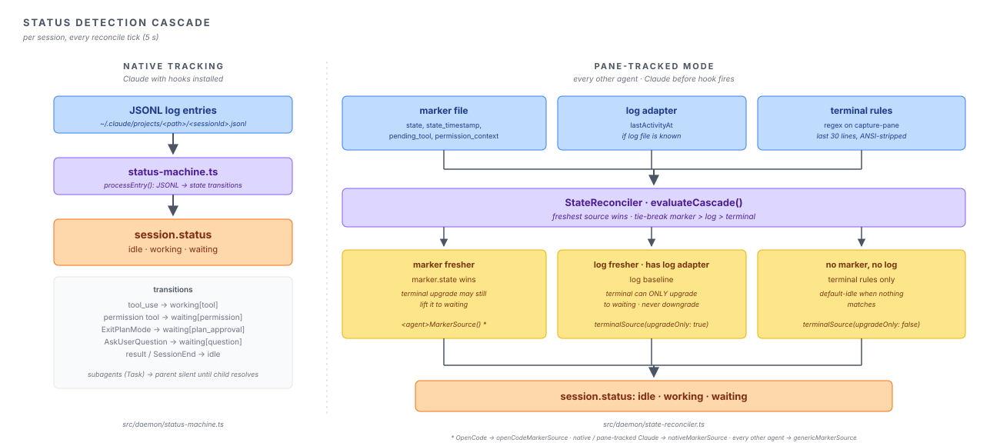
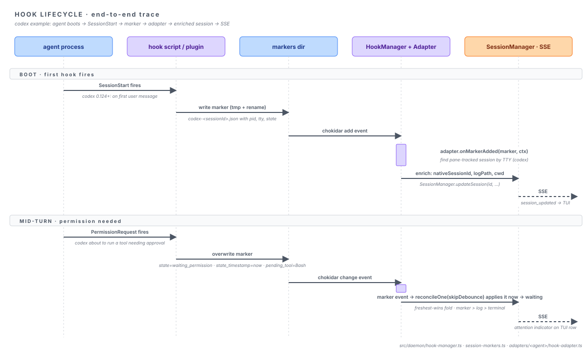

# Architecture

Deep-dive notes for contributors. For the high-level picture and the system overview diagram, see [the README](../README.md).

## The core problem

ccmux exists to bridge a fundamental gap: AI agents running in tmux panes are observable but not addressable from outside. A `ps` listing tells you "claude is alive in pane %12," but it can't tell you which Claude session UUID that maps to. Claude doesn't keep its JSONL log file open, so `lsof` won't link the PID to a log path. Codex, Cursor, OpenCode, Pi, and Antigravity each have their own variant of the same opacity.

The daemon merges three signals to derive per-session state, in order of trust:

| Signal            | Source                                                                   | Confidence                                         |
| :---------------- | :----------------------------------------------------------------------- | :------------------------------------------------- |
| Hook markers      | `~/.config/ccmux/session-pids/*.json` (written by hook scripts / plugin) | High. Agent-emitted lifecycle events.              |
| JSONL log entries | tailed log files, fed into the status machine                            | High. Exact tool calls, results.                   |
| Terminal patterns | regex over last 30 lines of `tmux capture-pane`                          | Low. Pattern-based, can miss scrolled-off prompts. |

## Status detection cascade

<picture>
  <source media="(prefers-color-scheme: dark)" srcset="./status-cascade-dark.svg">
  
</picture>

ccmux runs each session through one of two tracking modes per tick.

**`native`** is Claude only. The session has a real `nativeSessionId` (UUID), a known JSONL log file the daemon tails (`LogWatcher`), and a status state machine (`status-machine.ts`) that consumes log events: assistant `tool_use` becomes `working[tool]` (including tools that would require permission — see below); `ExitPlanMode` becomes `waiting[plan_approval]`; `AskUserQuestion` becomes `waiting[question]`; result entries and `SessionEnd` become `idle`. Subagents (`Task` tools) flip the parent to silent-working until the child resolves. The state machine does NOT derive a `waiting[permission]` from a tool_use: Claude Code writes a permission-gated tool_use to the transcript only AFTER the user resolves the prompt (verified against Claude Code 2.1.214), so a tool_use we can read has already been approved and is executing. Deriving `waiting` from it would only phantom-fire under auto-accept/bypass modes; genuine permission prompts reach the row via the `Notification`-hook marker (`waiting_permission`) instead. See the subagent-tracking note below for the full rationale.

**`pane-tracked`** is every other agent, plus Claude before its hook fires. The session is identified by tmux pane (synthetic ID like `codex_pane963`). Status comes from terminal scanning, hook markers (if installed), and log entries (if available).

Both modes converge on a single pure fold: `evaluateCascade()` in `cascade-evaluator.ts`. The reconciler builds a `CascadeSource[]` from whatever signals are available for the session (marker, log adapter output, terminal rules), and the evaluator picks the freshest one. Each source carries:

- a candidate `CascadeState` (status, attentionType, pendingTool),
- a timestamp,
- a tie-break priority (`marker > log > terminal`),
- an `upgradeOnly` flag.

`upgradeOnly` sources can lift the result to `waiting` but never downgrade. This is how a stale terminal-detected `waiting` still catches a transient permission UI even when logs say "idle", and how logs holding `working` survive a brief moment when the visible 30 lines don't contain ccmux's patterns. When two sources tie on timestamp, the priority order resolves the conflict.

Per-tick the reconciler assembles a slightly different source set:

- **Pane-tracked** (`reconcilePaneTrackedAgentSession`): `terminalSource()` (default-idle baseline), `genericMarkerSource()` if a marker exists, `logSource()` if a log adapter exists. OpenCode uses `openCodeMarkerSource()` to fold its multi-session aggregation in.
- **Native Claude / Codex** (`reconcileNativeCascadeSessions`): `nativeLogSource()` (the status-machine output) plus `nativeMarkerSource()` if a marker is present, with a targeted pane capture providing an `upgradeOnly` terminal source for stale "working" sessions (disambiguates "still going" from "stuck on plan approval").

A safety net: if the process PID is unknown (off-path session, crashed parent), log-file mtime caps a stale "working" to `idle` after 10 minutes (`status-machine.ts`).

**Retiring a spent permission marker.** Escape on a Claude permission prompt fires no hook, so the marker keeps claiming `waiting_permission`, and on the native path nothing could contradict it: `nativeLogSource()` echoes the stored `waiting` back at the marker's own timestamp every tick, so it ties the marker rather than out-freshening it, and the tie resolves to the marker. Only a source stamped now can win. The stale-session pane check, meanwhile, only looks at sessions that are `working`. The row sat at `waiting` until the next real turn, refusing every handoff (issue #117). The fix reads the pane the native path already captures while a marker claims a permission wait, and for a session the store still shows as `waiting` whose marker is older than `STALE_PERMISSION_GRACE_MS` (30s, covering the draw of the prompt that marker is about), a POSITIVE observation of an empty composer with no prompt under it (`showsIdleClaudeComposer`, `pane-classify.ts`) enters the fold as a baseline terminal source stamped now. That is the one place a terminal observation may lower a marker's `waiting`. Positive, not "no permission pattern matched": Claude's permission prompt matches none of its own terminal rules, so absence of a match is not absence of a prompt. The `waiting`-only gate is what keeps this a ONE-SHOT correction rather than a pin, and it is load-bearing for a second reason: Claude keeps its composer on screen while it WORKS, so the composer proves no prompt is up and nothing more. A keyboard approval leaves an identically stale marker behind a log that says `working`, and there the log is already right. Everything else ambiguous keeps the row `waiting` too (a composer with typed text in it, a prompt rendered below the last composer line, an unreadable pane), because a slow row is recoverable and a cleared attention indicator is not.

## Process discovery (`processes.ts`)

Every scan tick lists processes with `ps`, matches each command line against the agent defs, then resolves the survivors' `cwd` and `tty` with one batched `lsof`. The tty is what makes a process bindable — the binder matches it against the pane's tty — so a process without one never becomes a session.

**Where the tty comes from is platform-dependent**, expressed as a `DiscoveryPlatform` record chosen once. macOS leaves `tty` out of the `ps` columns and harvests it from the fds of `lsof -a -p <pids> -d cwd,0,1,2 -Ffn`, because BSD `ps` builds a full device-name table whenever the column is requested (~136ms vs ~55ms on a 1200-process machine; narrowing to specific pids doesn't avoid it). Everywhere else `ps` keeps the column and lsof stays untightened, since Linux reads tty straight from procfs and lsof builds vary in how they honor `-d`. Both records feed the same parse-and-fold, so the platform choice never spreads past that one value — and every flag in them is load-bearing in a way that fails _silently_ when undone (`-a`, exactly fds 0/1/2, the `f` field selector). Each is documented at its definition in `processes.ts`; read those before editing an invocation.

**Making lsof the tty source makes it fail-closed too.** On macOS a dead lsof means every row takes `tty: null` and is filtered away, so discovery would return `[]` — indistinguishable from "no agents are running", the one answer the scan loop acts on destructively (wipe every session, delete every marker). So `batchGetProcessFdInfo` separates _lsof ran_ from _lsof did not_: a non-zero exit that still carried records is the routine case (a pid died between `ps` and the lsof call) and degrades to a few dropped rows, while a spawn exception or a non-zero exit with nothing parseable raises `ProcessDiscoveryError` and skips the cycle. Only the fd-tty platform throws; where `ps` supplies the tty, lsof contributed just the cwd and losing it is survivable. The residual single-row case — lsof succeeding but omitting one live process — is absorbed downstream by two-scan hysteresis in both session cleanup (`binder/cleanup.ts`) and marker cleanup (`cleanupStaleMarkers`).

Filter order after lsof is load-bearing too: drop the tty-less → drop codex plugin hosts by cwd → `dropWrapperParents`. The plugin host must go before wrapper dedup (it is a same-tty child of the real codex, so it would evict its own parent), and the tty filter is what keeps pipe-stdio processes — subprocess-mode invokes like `codex exec`, MCP servers, language servers — from becoming phantom rows on the pane the daemon happens to be running in.

## Session-to-pane binding (the binder)

A session (a discovered agent process, or a hook marker) has to be pinned to the tmux pane it lives in before the TUI can route you there. `binder/` (`scan.ts`, `assign.ts`, `migrate.ts`, `links.ts`, `cleanup.ts`, `primitives.ts`, …) owns that policy; `session-pane-match.ts` is a thin I/O wrapper — `matchSessionsToPanes` snapshots sessions + markers, calls `decideScanBindings`, and applies the emitted bindings to the real `SessionManager`.

Marker claims settle first, across all panes, and are authoritative — re-asserted every scan, so a mis-bind heals. Only then do the heuristic arms run over the post-marker state. `scan.ts` drives the per-scan ladder (marker → pane-holder → live-pid arms) on working copies that simulate the `SessionManager` setter semantics.

For panes no marker claims, each same-cwd group of sessions and candidate panes is solved as one small optimal assignment (`assign.ts`), gated by three guards:

- **D1 — direction skew:** a session's timestamp may precede its process start by at most a small skew.
- **D2 — tolerance cap:** a match beyond 600s of separation is rejected.
- **D3 — ambiguity refusal:** a near-tie leaves the row visibly unbound rather than guessing.

"Pane timestamp" survives only as the boot-migration fallback (`migrate.ts`), for procs whose `ps etime` start time is unparseable. There is no "most recent file" arm.

## Log tree watching

`log-tree-watcher.ts` is the recursive-`fs.watch`-backed substrate behind `LogWatcher` for the agent log trees (`~/.claude/projects`, `~/.codex/sessions`). It exists because chokidar arms one watcher per directory, and that setup alone cost seconds of daemon boot on session-heavy machines.

Platform event names are unreliable and FSEvents coalescing is stream-local, so events are classified by `stat` + a known-files set, and every event reconciles a subtree (walk for new files, sweep for gone ones). `ready` is deferred ~50ms to cover the stream's arming window. It falls back to chokidar when the root is missing or recursive watching is unsupported.

Watching is not the whole append story. An adapter sets `pollsLog` (`LogAdapter`, Codex only today) when its agent holds the log's file descriptor open for the life of the session: macOS emits no change event for appends made through an open fd, so `~/.codex/sessions` is watched for new and removed rollouts but is silent about the writes into them. `LogWatcher` stat-polls those adapters' linked log files once a second (`LOG_POLL_INTERVAL_MS`, `src/daemon/watcher.ts`) and dispatches the grown ones through the same debounce a real change event uses, so the polled and event-driven feeds stay one code path.

### Multiple Claude config dirs

Claude Code writes transcripts to `$CLAUDE_CONFIG_DIR/projects`, so a second account (a work login in `~/.claude` plus a personal one under `CLAUDE_CONFIG_DIR=~/.claude-personal`) lands in a separate tree. `resolveClaudeProjectDirs` (`lib/config.ts`) collects `~/.claude` plus every dir from the `additionalClaudeConfigDirs` preference and `CLAUDE_CONFIG_DIR` (deduped, primary first). The daemon stands up one `ClaudeLogAdapter` + `LogWatcher` per tree — the same fan-out shape as one-adapter-per-agent — all feeding the shared `SessionManager`. Empty unless configured, so default single-dir behavior is unchanged. Only extra trees add watchers; the primary `~/.claude/projects` watcher stays authoritative for marker-driven, path-agnostic `processPath` routing, and `buildLogPath` probes every tree to locate a session's transcript.

Because a transcript lives in exactly one tree, marker events route to the watcher that owns the session: `LogWatcher.ownsSession(id)` reports whether that tree has discovered the session's log, and the Claude adapter's `ownerFor` (`getLogWatchers("claude")` → `find(ownsSession) ?? watchers[0]`) picks the owning watcher, falling back to the primary for sessions no tree has discovered yet (e.g. a marker written before the first turn). For the same reason, per-watcher freshness state (`isRecentlyProcessed`) is folded across all Claude watchers in the reconciler, so a second-account session isn't invisible to the just-processed debounce guard.

## Subagent tracking (Claude)

Claude Code writes per-subagent transcripts to `<projects>/<encoded>/<sessionId>/subagents/agent-*.jsonl`; `ClaudeLogAdapter` owns a private chokidar instance for that layer and folds each file's derived state into `Session.subagents`. Each entry also carries `startedAt`, read once from the transcript's first entry (`readFirstEntryTimestamp`) and carried forward; the head is immutable, so re-reads after eviction or a daemon restart derive the same value. The preview renders it as runtime-since-spawn, the same clock Claude's own agent panel shows; staleness detection stays on `lastActivityAt`. `getEffectiveStatus` (used by every TUI consumer) then lifts the parent: any active subagent (working or waiting) lifts an `idle` parent to `working` (rendered as "agents"), so a lead sitting at its prompt never renders as done while its agents run. A subagent's `waiting` deliberately does NOT surface as row-level waiting: it is log-derived from an unresolved tool_use, which a tool mid-execution and a genuine approval prompt exhibit identically, so it would false-alarm under bypassPermissions. The same reasoning removed log-derived permission waiting from the MAIN transcript (`processAssistantEntry`): Claude Code defers writing a permission-gated tool_use to the transcript until AFTER the user resolves the prompt (verified against Claude Code 2.1.214), so any such tool_use the daemon reads is already approved and executing. Inferring `waiting` from it phantom-fired "Needs permission" notifications for the tool's whole run under `--dangerously-skip-permissions`, in-session auto-accept, and `defaultMode: "auto"`, with no prompt on screen. Genuine permission prompts surface in the lead's own pane and reach the row through the higher-fidelity signals: the `Notification` hook flips the marker to `waiting_permission` for native sessions, and the terminal detector reads the prompt off the pane for pane-tracked ones.

Subagents come in two flavors with different lifecycles, and the adapter must handle both:

- **Blocking `Task` tools**: the parent transcript records the tool_use, so the status machine tracks pending task IDs (`hasActiveSubagent`), and the subagent's own log ends with `end_turn` (it self-reports idle, and idle entries self-evict via `SessionManager.updateSubagent`).
- **Background teammates** (`Agent` tool, `taskKind: in_process_teammate`): the tool_result acks in milliseconds and the parent ends its turn, so the parent log carries **no** subagent bookkeeping, and the teammate's transcript never records a terminal `end_turn`. Filenames embed the agent name (`agent-areviewer-functionality-<hex>.jsonl`), not just hex.

That forces four design points:

1. **Discovery keys off the directory, not the parent log**: the adapter attaches when `hasActiveSubagent` is set _or_ when any `agent-*.jsonl` in the subagents dir was written within `SUBAGENT_STALE_TIMEOUT_MS` (probe result cached ~15s, since parent parses are frequent).
2. **Evaluation cannot be parse-driven alone**: parent log parses stop at `end_turn`, and teammates often start writing only after the parent's last parse (verified live). `LogAdapter.onReconcileTick`, called from `tickLogAdapters` every reconciler scan, re-evaluates attach/teardown independent of parent activity.
3. **Completion is inferred from silence**: the reconciler's `capStaleSubagents` sweep downgrades active (`working` or `waiting`) subagents whose logs have been silent past `SUBAGENT_STALE_TIMEOUT_MS`; the downgrade to idle also removes the entry. The threshold is deliberately generous (a subagent inside one long Bash call appends nothing while genuinely working).
4. **Teardown requires all signals gone**: the dir watch is dropped only when the subagents array is empty, the parent has no pending tasks, and the dir is inactive. The parent reading `idle` is explicitly _not_ an exit signal — it's the normal background-agent state. Sharing the staleness threshold between the attach probe, the seed cap (`capStaleSubagentSeed` on re-attach seeding), and the sweep is what prevents attach/teardown loops.

## Hook lifecycle

<picture>
  <source media="(prefers-color-scheme: dark)" srcset="./hook-lifecycle-dark.svg">
  
</picture>

Without hooks, ccmux is best-effort: it scans pane content and guesses. With hooks installed via `ccmux setup`, agents emit authoritative lifecycle events that map to a stable session UUID, turning each agent from "seen" into "tracked."

### Marker file shape

The entire interface between ccmux and the agent is one JSON file per session, written via tmp+rename so the daemon's chokidar watcher only sees finished writes (`session-markers.ts`):

```ts
{
  agent_type: string,
  pid: number,
  tty?: string,                  // Omitted for OpenCode/Cursor (PID-ancestry pane correlation)
  session_id: string,
  transcript_path?: string,
  timestamp: number,
  state?: "idle" | "working" | "waiting_permission",
  state_timestamp?: number,      // Fresher than `timestamp` if set
  pending_tool?: string,         // From PermissionRequest hook (Codex/Cursor), tool_approval_requested (omp)
  permission_context?: string,
  directory?: string,            // OpenCode only
  title?: string,                // OpenCode only
  last_prompt?: string           // Cursor / OpenCode
}
```

### Per-agent strategies

| Agent       | Mechanism                                                                                                                                                                                                                                                                                                            | Pane correlation                                  |
| :---------- | :------------------------------------------------------------------------------------------------------------------------------------------------------------------------------------------------------------------------------------------------------------------------------------------------------------------- | :------------------------------------------------ |
| Claude      | 3 shell scripts (`SessionStart`, `SessionEnd`, `Notification`) registered in `~/.claude/settings.json`.                                                                                                                                                                                                              | TTY match (`marker.tty` to `pane.tty`)            |
| Codex       | 3 shell scripts (`SessionStart`, `Stop`, `PermissionRequest`) in `~/.codex/hooks.json`, plus the codex hooks feature flag in `config.toml` (`[features] codex_hooks = true` pre-0.124, `[features] hooks = true` on 0.124+; ccmux recognizes either).                                                                | TTY match                                         |
| Cursor      | 4 shell scripts (`sessionStart`, `sessionEnd`, `beforeSubmitPrompt`, `stop`) via `~/.cursor/hooks.json`. Scripts walk PID ancestry to find the real `cursor-agent` PID (Cursor invokes hooks via `/bin/zsh -c`, so `$PPID` is a transient shell).                                                                    | PID-ancestry: `ctx.getPaneHostingPid(marker.pid)` |
| OpenCode    | One JS plugin at `~/.config/opencode/plugin/ccmux.js` subscribed to OpenCode's message bus (no shell hooks; pure `node:fs/promises` so the same file runs on Bun or Node).                                                                                                                                           | PID-ancestry; one server hosts N sessions         |
| Pi          | One JS extension at `~/.pi/agent/extensions/ccmux.js` subscribed to Pi's lifecycle events (no shell hooks; pure `node:fs/promises`, auto-discovered and loaded via jiti). Writes the marker at `session_start`, which fires at launch with full identity (pid, session id, transcript path, cwd).                    | PID-ancestry; one session per process             |
| omp         | One JS extension at `~/.omp/agent/extensions/ccmux.js` subscribed to omp's lifecycle events (oh-my-pi is a hard fork of Pi and kept its extension API, so the file is a near-copy of Pi's). Adds approval tracking: `tool_approval_requested`/`resolved` drive `waiting_permission`, which Pi has no equivalent for. | PID-ancestry; one session per process             |
| Antigravity | 2 shell scripts (`PreInvocation`, `Stop`) via global `~/.gemini/config/hooks.json`. The first `PreInvocation` creates the marker because Antigravity exposes no session-start hook.                                                                                                                                  | TTY match with PID-ancestry fallback              |

### Lifecycle (`hook-manager.ts`)

1. `ccmux setup` runs `adapter.install()`. Idempotent: writes scripts and edits agent config.
2. Agent fires hook, script writes marker file.
3. `HookManager.start()` first replays existing on-disk markers (covers "daemon was down when agent booted"), then opens chokidar with `ignoreInitial: true`.
4. Add event triggers `adapter.onMarkerAdded(marker, ctx)`. The adapter locates the matching pane-tracked session, sets `nativeSessionId`, `logPath`, `cwd`, and (Claude) starts log-tailing. A marker written before the daemon's first scan created the pane-tracked session would otherwise be orphaned; the shared, agent-agnostic `reconcileSessionMarkerLinks()` (`adapters/link.ts`, keyed off `adapter.agentType`) closes that race on the next scan and re-derives native-id ownership each scan so a mis-linked id heals.
5. Per-turn signals (Claude `Notification`, Codex `PermissionRequest`, Cursor `beforeSubmitPrompt`, OpenCode `permission.asked`, Pi `agent_start`/`agent_end`, omp `agent_start`/`agent_end` plus `tool_approval_requested`/`tool_approval_resolved`, Antigravity `PreInvocation`/`Stop`) update the marker's `state` and `state_timestamp`. The next reconcile tick picks them up via the freshest-wins cascade (`evaluateCascade()`).
6. Cleanup: `cleanupStaleMarkers()` groups by `(agent_type, session_id)`, dedupes, and applies a 3-level liveness check (PID, TTY, adapter callback `isSessionStillLive`); any failed check unlinks the marker.

### OpenCode aggregation

OpenCode is the special case. A single OpenCode server process hosts N sessions, so N markers share one PID. `aggregateOpenCodeMarkers()` (`adapters/opencode/aggregate.ts`) folds them into one ccmux session with worst-of status (waiting > working > idle). `attentionType`, `pendingTool`, `cwd`, and `nativeSessionId` follow the newest-waiting or newest-activity marker. Re-folded on every reconcile tick (not just on marker add or remove), so newly-waiting siblings show up promptly.

## Single source of truth for adapters

`createBuiltinHookAdapters()` in `src/daemon/adapters/index.ts` is consumed by both the daemon (for runtime registration) and `setup.ts` (for install / uninstall commands). This prevents the historic footgun where a new adapter got registered for daemon dispatch but not for `ccmux setup` (or vice versa).

## Programmatic invocation (`/invoke`)

`POST /invoke` and the `ccmux invoke` CLI drive a single agent turn programmatically. The path is split behind a registry seam:

- `InvocationManager` (`src/daemon/invocation-manager.ts`) owns the request lifecycle — concurrency cap, duplicate-id guard, cancel-before-start stash, and per-invocation timeout. It does not know how any specific agent runs. It also keeps a status-only store of active + recently-finished invocations (TTL-purged) and is an `EventEmitter` (fires `change` at start/finish); `GET /invocations` reads the store and `ccmux invoke list` renders it.
- `InvocationRegistry` (`src/daemon/invokers/registry.ts`) maps an `AgentDef` to an `Invoker`. Agents with `invokeMode` set go to `SubprocessInvoker` (`Bun.spawn` against `agent.invokeMode.args`); the built-in `claude` agent goes to `ClaudeInvoker` (drives the interactive TUI inside a detached `ccmux-invoke-<id>` tmux session and parses the transcript JSONL).
- `capabilitiesFor(agent, invoker)` derives `InvokerCapabilities` (`requiresHooks`, `supportsSessionResume`) from the invoker kind — the claude-interactive branch returns fixed capabilities, the subprocess branch reads the agent's `invokeMode` — and the server gates pre-flight checks (e.g., Claude's hooks precheck) through it. Invokers declare no capabilities of their own, so `AgentDef` stays the only place registering which agent can do what.

This split lets the manager stay generic, lets each invoker focus on one execution mode, and lets the server reject impossible requests (e.g., `--session` against a non-resumable agent) before the manager spends a slot.

`SubprocessInvoker` pipes the prompt via stdin, except when `invokeMode.args` carries a `{prompt}` placeholder (gemini's `-p {prompt}`): then the prompt rides in argv (stdin skipped), capped at `MAX_ARGV_PROMPT_BYTES` (120 KiB) to avoid a Linux-only `execve` E2BIG. Full output of subprocess invokes is captured to an ephemeral per-daemon store (`invocation-results.ts`): each invoke's stdout/stderr is written to a `0700` `mkdtemp` dir keyed by id (5 MiB cap), and `ccmux invoke result <id>` reads it back via the server, reap-tolerant (a gone file is a clean miss; cleanup is delegated to the OS `/tmp` reaper). Claude invokes drive a tmux session with no stdout buffer, so their `result` is always a miss in v1.

The board renders these invokes live. The server broadcasts `invocation_started` / `invocation_finished` SSE events (via the pure `invocationEventToSSE` mapping) and embeds an `invocations` snapshot in the `init` event for reconnect reconciliation. `invocation_started` also carries the cwd's `project`, `isWorktree`, `mainRepoRoot` and `worktreeRoot`, resolved daemon-side by `deriveProjectInfo`: a subprocess invoke never becomes a daemon session, so this event is the only chance to give its fabricated row the git-aware project the repo's real sessions group under, and the resolution walks the filesystem, which must stay out of the TUI process. It is resolved synchronously (a memoized `.git` walk, never a git spawn) because the invocation stream must stay in strict order with `init` and `session_created` — the board's reconcile and its Claude-invoke de-dup both depend on that ordering. The fields are optional on the wire so a board talking to an older daemon still renders, falling back to the cwd basename. The TUI store synthesizes a paneless row per subprocess invoke (a Claude invoke already appears as its real `ccmux-invoke-<id>` session, so it is skipped to avoid a duplicate), surfaces a live `N invoking` count, and routes kill / restart on such a row through `POST /invoke/:id/cancel` (a one-shot worker has no real session to kill). `kill-all` is reaped daemon-side instead: `handleKillAllSessions` cancels every in-flight invocation from `InvocationManager.listInvocations()` (the authoritative set), since the client's in-flight set is a lossy mirror that never hydrates invokes a mid-run-opened TUI did not see start. Synthetic rows carry `tmuxPane: null`, so the picker's pane-touching paths (attach, preview, switch) all guard on a real pane.

## Session references (`session-ref.ts`)

`resolveSessionRef(ref, ctx)` is how a human or a peer agent names a session without knowing its id. It is pure and synchronous (window and session facts come from the daemon's own pane cache, so resolving never costs a tmux call), and it returns `resolved` (with `tier`, `exact`, `proximity`), `ambiguous` (with every candidate of the matched tier), or `not-found`.

Six tiers, stopping at the **first tier with any match**: session id, `%pane`, `session:window.pane`, `self`, then the fuzzy pair of agent type and project/directory name. Tiers 1-2 reproduce `DaemonServer.resolveSession` exactly, which is why that function is left alone: existing callers keep their behavior and this one extends around them.

The exact tiers **claim their syntax**. A ref shaped like a pane, a coordinate, or the literal `self` that matches nothing returns not-found instead of falling through to the fuzzy tiers, so a mistyped pane id reads as "no such pane" rather than silently becoming a project search that lands on an unrelated session.

Proximity narrows the **scope** a fuzzy ref is searched in (same window > same tmux session > global) and never picks between candidates: the nearest scope holding any match decides, a unique match there wins even when farther matches exist, and more than one there is a refusal. This is the binder's prime directive applied to a second surface, **ambiguity refuses, never guesses**, so there is no recency tie-break and deliberately no `--first`-style override. The refusal carries every match of the tier (not just the refusing scope's), sorted nearest-first, because the farther ones are legitimate next commands and the listing IS the recovery path.

Callers pass the caller's `$TMUX_PANE` as `callerPane` (`GET /transcript` as a query param, `POST /handoff` in the body). Absent, every fuzzy search runs at global scope, which is the correct answer for a caller outside tmux.

## Reading a session's last response (`/transcript`)

`GET /sessions/:ref/transcript?turns=N` answers with the last N completed turns of a session's conversation, read from the agent's own transcript. `ccmux last` is the CLI over it; `POST /handoff` and the TUI's "Copy last response" are its other two consumers.

The read is split the same way the invoke path is: `transcript-read.ts` holds the primitives (a backwards line walk, the JSONL turn fold, the size guards) and `transcript-readers/` holds one file per agent plus a registry. Adding an agent is a new file and one entry; nothing in the endpoint changes. A reader returning `null` (no path, unreadable file, no completed turn yet) means "fall back to the pane" to its caller.

**Backwards line walk, not a fixed byte window.** A single Claude JSONL line can be hundreds of KB (a 665K-char tool result exists in a real transcript), which defeats every fixed window the codebase already has: `readTranscriptTail` returns `""` when its window holds no newline. Walking backwards line by line lets an oversized line be **skipped unparsed** while the walk continues, and lets the fold stop as soon as it has the turns it was asked for. The walk is byte-level and joins bytes across chunk boundaries before decoding, since slicing a file at an arbitrary offset can split a multi-byte UTF-8 character.

Where the transcript lives differs per agent: most readers take `session.logPath` (from the marker's `transcript_path`, or from log discovery), OpenCode queries its SQLite database by native session id, and Gemini locates its chat file from the session's cwd because it has no hooks and therefore no marker. Consequence worth knowing: a session ccmux tracks but whose transcript it has not located (a pane-tracked agent with no marker, say) reads as "nothing to read" and degrades to a pane capture.

**Turn shape is pinned** so every reader matches: `turns=N` yields N assistant entries plus only the prompts BETWEEN them, never a leading prompt. `turns=1` is exactly one assistant entry (the same shape as the pane fallback, which keeps `ccmux last | pbcopy` clean), `turns=2` is `[assistant, user, assistant]`, i.e. 2N-1 entries; a transcript that runs out early produces the same shape with fewer entries.

Guards: 20 turns per request (clamped daemon-side), 20,000 chars per turn with **tail-preserving** truncation (a response's conclusion is at its end), and transcript lines over 256 KiB skipped unparsed: in every sampled transcript a line that size is a tool result, and tool inputs/outputs are never part of a transcript response. Any of them dropping content sets `truncated: true`.

The response's optional `resolution` field carries how the `:ref` was read (tier, exact, proximity). It is what the CLI's stderr echo renders, and what `POST /handoff` reports for both of its ends. `capturePane` returns `""` on any failure, so an empty capture is a 400 rather than an empty success.

## Handing off (`/handoff`)

`POST /handoff` reads one session's last response and gives it to another session, or to a session spawned for it. It is composed **server-side** deliberately: the payload never transits the caller's context, so an orchestrating agent can move a peer's long answer to another peer for the cost of one command, and the provenance header can be trusted to describe the session it names. The pure parts (header formatting, compose-with-cap, the queue) live in `handoff.ts`; the guard stack and delivery live in `server.ts`, which owns the tmux side. Full user-facing behavior is in [`docs/handoff.md`](handoff.md).

**The whole safety case is one rule: a handoff is only ever typed into an IDLE composer.** Typing text + Enter into an idle composer is verified for all nine built-ins (it is the notification-reply path); what mid-turn typed input does is verified for none of them, Claude included. So `idle` delivers, `working` enqueues, and `waiting` refuses outright (answering a permission dialog with a pasted peer response is not a thing anyone asked for). There is no `--force`.

**Refusals over degradation.** A source with no readable transcript is refused rather than falling back to a pane capture: a screen scrape is fine to READ (`GET /transcript` falls back to one) and useless as a PROMPT. An ambiguous ref at either end is refused with the candidate list, the `to` end especially, because delivering a prompt into the wrong session is the worst thing this endpoint can do.

**The guard stack** is borrowed from `notification-action.ts` via the shared `send-guards.ts` module, and it splits across two moments. **Sanitizing happens at COMPOSE time**, before the request is routed by target status, and it happens twice on purpose: once over the transcript payload as it is read, and again over the final composed text, because a caller-supplied note is only whitespace-folded (`\x1b` is not `\s`) and a POSIX cwd may legally contain control bytes, so either can carry an ESC into the header, and a literal ESC inside a bracketed paste can emit its `ESC[201~` terminator early and leak the remainder into the pane as live keystrokes. **The target checks happen at DELIVERY time** (`deliverHandoff`), in order: `ambiguousWait` and no-pane first (both disqualify the target outright, so queueing would only defer the same refusal by up to half an hour), then the status gate, then foreground liveness, **fail-closed** (the reconciler keeps a dead agent's session idle with its pane still bound, so a handoff pasted after the agent exited would run a peer's prose as shell commands), then the per-agent `unsafeReplyPattern` check and the leading `/`/`!` defuse. Delivery never strips, and does not need to: what it holds is already-sanitized text. The `unsafeReplyPattern` check is the one target check that ALSO runs at enqueue (`queueHandoff`), because both of its inputs are frozen by then (the composed text, and the target agent's own pattern): a payload that agent can never receive is knowable while the sender is still listening, and queueing it instead told the sender "queued" and dropped the record half an hour later with nobody left to report it to. The cwd is backticked in the header for this check's sake: Cursor's pattern is `/(^|\s)\/\S/`, which a bare absolute path after a space matches, so an unquoted cwd made ccmux's own header refuse every handoff into a cursor target.

**The queue** (`HandoffQueue`) is modeled on `invocation-manager.ts`'s record store: a plain `Map`, purge on access, plus an `.unref()`'d sweep timer so it can never keep the daemon alive on its own. At most **one pending handoff per target**, TTL 30 minutes; a second enqueue replaces the first and reports it, because a queue of prompts would arrive as a burst of pastes the moment the target went idle, which is the exact behavior the idle-only rule exists to avoid. Delivery fires on **any** transition into idle rather than `working -> idle` specifically (a target can pass through `waiting` on its way out of a turn), takes the record synchronously before delivering (so two overlapping idle observations cannot paste it twice), and **re-runs every delivery-time check**, because a record can be half an hour old and every target fact those checks read can have moved. The text itself cannot move, which is the point of storing it composed and stripped: the dequeue path re-derives nothing and re-sanitizes nothing. A failure at dequeue splits two ways, because the sender was already told it was queued and is no longer listening. A DETERMINISTIC refusal (`unsafe-payload`, `not-at-agent`, `target-waiting`, `ambiguous-wait`, `no-pane`) drops the record and logs why, since re-running a check that just said no would only say no again. A TRANSIENT one (the tmux send failed, or the target turned over between the readiness check and the paste) calls `requeue` with the attempt counted, for the next idle transition to retry, bounded by `MAX_HANDOFF_ATTEMPTS` (3). A requeue keeps the record's original `expiresAt`, so retries cannot extend the TTL, and it refuses to overwrite a newer handoff that arrived while this one was out being delivered. The queue is in memory only: a daemon restart drops every queued handoff, including ones whose senders were told "queued". The enqueue path also calls the delivery once itself, because the target may have gone idle between the status read and the enqueue, in which case its transition already fired and nothing else is coming.

A pending handoff rides the wire as an optional `pendingHandoff: {fromSessionId, queuedAt}` on `EnrichedSession` (enrich-time only, read from the queue, never persisted), and the daemon re-broadcasts the row when one is queued, delivered or expires. The payload is deliberately not on the wire: it is a prompt for the target agent, not content for a session list.

**`--spawn`** rides `POST /spawn` rather than re-deriving any of it, defaulting the agent and cwd to the source's. A multiline prompt survives spawn's `send-keys`-without-`-l` layer intact (verified live for claude and codex): the prompt is always inside single quotes, so every embedded newline arrives while the shell is mid-string and reads as a continuation, and the raw bytes land in argv unchanged. A codex spawn returns a note rather than an auto-answer, because codex holds its initial prompt behind a first-run directory-trust question and the new pane looks stalled until someone answers it.

`MAX_SEND_PASTE_CHARS` (65,536) is applied to the **final** composed text, header included, since it is a transport budget for what gets pasted rather than a budget for what was read. The spawn path budgets the same text a SECOND time and in a different unit: `composeHandoff` caps UTF-16 CHARS while a spawn prompt is bounded in BYTES by `MAX_SPAWN_PROMPT_BYTES` (120,832), so a CJK- or emoji-heavy payload can sit under the char cap and still overrun the argv budget. `handoffToNewSession` therefore pre-checks the byte length and refuses with `too-large` in handoff's own terms, naming `--turns` as the retry: forwarded instead, it comes back as a 400 about an invalid `prompt` field, which is not a field this caller ever sent.

## PR enrichment

`pr-resolver.ts` maps an agent-agnostic `(cwd, branch)` to its open PR via `gh pr list --head`. Owned by the Server (like `gitInfoCache`). Reads are synchronous against a split-TTL cache (stale-while-revalidate; default branches skipped):

- Successful lookups expire after 2 min, so merges clear and new PRs appear quickly.
- Failed lookups (null) hold for 10 min as backoff — their causes (no GitHub remote, logged-out `gh`, deleted cwd) persist on the minutes scale.

Refreshes run in the background; a changed value re-broadcasts the affected sessions via `session_updated`. Because refreshes are demand-driven, the Server also sweeps every visible session's `(cwd, branch)` key every 2 min so a fully idle row can't serve a stale PR indefinitely. `PRResolver`'s own concurrency cap (`MAX_CONCURRENT_REFRESHES`, 4) means a cold sweep can only start refreshes for a handful of keys per pass; `sweepBranchPRs` rotates its starting position through the visible-session list by one session per sweep (`sweepOffset`) so every key gets a guaranteed refresh attempt within `len` sweeps, `len` being the number of visible sessions, rather than the same leading handful winning the cap's slots every time. Worst-case staleness is therefore TTL + `len` × sweep interval in the degenerate all-cold-cache case, though in practice the cap clears a cold cache in a small handful of sweeps. The sweep reads the branch out of `gitInfoCache` (falling back to the log-derived one) rather than re-enriching, so it never spawns git — its whole job is to touch PR keys. That is also an accepted trade: an idle session's branch label no longer self-heals off a `git checkout` run in its pane, since the sweep never re-derives git. Only an organic event (the pane's own agent doing something) or a fresh SSE connect re-reads git and picks up the new branch.

Fail-soft: a thrown spawn disables the resolver for the daemon's lifetime only when a `Bun.which("gh")` probe confirms the binary is missing; otherwise (e.g. a deleted worktree cwd) the key is negative-cached. A non-zero `gh` exit (not a repo, no GitHub remote, unauthed) is likewise a per-key negative.

The lookup also fetches `reviewDecision` and `statusCheckRollup`, folding the rollup daemon-side via `foldChecks` (mirrors gh's PR-status rollup as shown by `gh pr view` / `gh pr status`; empty rollup = `"none"`, never `"passing"`) into the `reviewDecision` / `ciStatus` fields on each `BranchPR` that drive the TUI's PR-cell color. `samePRs` compares these, so a CI or review flip re-broadcasts the session even when id and href are unchanged. Feeds `EnrichedSession.branchPRs`; the TUI's `pr` field prefers background rows' authoritative `backgroundChildren` and falls back to this.

## Worktree pruning

Worktree creation (`worktree-create.ts`, the counterpart to this module) is what `ccmux spawn --worktree` and the picker's worktree destination call to create or open a worktree before an agent starts in it: mechanical name derivation from `--worktree`'s value or the prompt's opening words (no model involved, so a name is predictable and reproducible), per-repo locking around `git worktree add` so concurrent spawns don't race, and the same `worktree.symlinkDirectories` / `.worktreeinclude` file-setup conventions Claude Code applies to its own worktrees.

`worktree-move-changes.ts` sits on top of creation rather than beside it. `POST /spawn` with `worktree.withChanges` routes the whole destination through `moveChangesToWorktree`, injecting `createWorktree` as its `CreateWorktree` seam (curried with the repo root and the name-deriving prompt, with an `ok: false` result converted to a throw so the module classifies it as `create-failed` and unwinds). The worktree is therefore created exactly once, inside the move's ordering — stash, create, apply, drop — and the pane is only opened after the move reports success.

The move also decides the base rather than letting the engine default it. `resolveBase` answers an absent base with the MAIN checkout's current branch, which is right for an ordinary spawn and wrong here: the source is routinely a linked worktree on a feature branch, and an edit to a file both histories have applies cleanly onto main, so the work silently lands on a history missing the commits it was written against. `runMove` therefore resolves the SOURCE's `rev-parse HEAD` before the push and passes that through the seam. A sha, never `--abbrev-ref`, which answers the literal string "HEAD" for a detached source and would be re-resolved against the main checkout. An explicit `base` still wins, and an unborn HEAD falls back to the engine's default.

The seam carries `created` as well as the path, and a worktree the engine merely OPENED is refused: the rollback force-removes the worktree, so it must never be handed one it did not make. The spawn handler prechecks an explicit name against the repo's registered worktrees before anything is stashed, so the ordinary case is a 400 with nothing touched; the module's own refusal covers the race the precheck can lose.

The hosting repo's `.git/info/exclude` gets a `**/.claude/worktrees/` line (`ensureWorktreesExcluded`, idempotent because `git check-ignore` — not a scan for our text — decides whether to write). Without it the first worktree makes the repo permanently "dirty": the picker's gate offers a move for a checkout whose only change is other agents' checkouts, the counts include them, and `--untracked copy` recursively duplicates every sibling worktree into the new one, since git reports a nested checkout as a directory even under `-uall`. The spawn handler calls it before either branch rather than relying on the engine's own call, because a move reads the source's status BEFORE it creates anything.

The whole transaction runs under a per-repository lock keyed on the shared admin directory (`rev-parse --git-common-dir`), because every linked worktree of a repo pushes onto ONE stash stack. It is a separate lock map from `worktree-create.ts`'s `withRepoLock`, which this one is held across.

A failed move is a 400 carrying `reason`, and `stashSha` when an entry was left holding the user's work. No pane is created. The source has usually been put back, but not always: `sourceRestored: false` means the restore itself failed (the checkout changed underneath the move), and the stash-confirmation failures return before there is a sha to report at all — in both cases the entry is the user's only copy, which is why the response says which situation they are in rather than assuming. A failure AFTER a successful move (tmux) is a 500 whose body still carries `move`, since by then the changes are already in the new worktree.

The ordering, and why there is no `git reset` of the source, is documented at the top of the module.

`worktree-prune.ts` answers "which of this repo's worktrees are finished" and, separately, performs the removal. The split is load-bearing: `scanRepos` only reads, and its output is the **only** input `runPrune` accepts. Note where the guarantee actually lives — `runPrune` trusts the candidate objects it is handed, so the re-scan is enforced by `handlePruneWorktrees` in `server.ts`, not by the prune module. A second caller that skipped the endpoint would lose it. `POST /worktrees/prune` therefore takes paths, re-scans in-process, and rejects (409) any path the fresh scan does not currently classify as removable — a stale client list, a replayed request, or a hand-written POST cannot delete a directory that has since become active.

Two more fields on that request are load-bearing rather than decoration. `cwd` must be the SAME directory the candidate list was fetched with, because the re-scan runs over the same discovery the listing ran over (below): omit it and the re-derivation sees a smaller set of repos than the client was offered, so a selection reachable only through the caller's own cwd 409s on a worktree the user is looking at. `callerPane` is the caller's own pane, exempt from the occupancy guard in the run phases below — while `ccmux worktree prune` runs, its own pane's foreground command is `ccmux` itself, so pruning from a pane sitting inside the worktree (the most natural way to do it) would otherwise refuse on this very process. Neither widens what is prunable.

The scan answers in three buckets. `candidates` are removable, each with a reason; a `skipped` row is one local evidence called finished but something withheld (see the PR-state rule below); an `open` row is one withheld because its PR is still OPEN — the healthy in-flight state. That last one is surfaced rather than silently dropped because the Worktrees panel paints a PR badge from it, and an open PR is the single most useful thing a row can say about a worktree. It stays out of `candidates` for the reason it always did: an open PR means the work is still in flight, whatever the local refs look like.

**Repo inventory.** Sessions are the inventory the daemon derives for itself: every `mainRepoRoot` across live sessions, so one session anywhere in a repo (its main checkout included) brings that repo's whole worktree list into scope and an abandoned worktree with no session of its own is still found. They are no longer the only way in, because a repo whose agents have all exited is exactly the repo whose stale worktrees you want to reclaim. `worktreeRepoRoots` (`server.ts`) takes two more inputs, and they are different kinds of thing. An explicit `repo` is the FILTER, and it is RESOLVED rather than matched against the session roots — `resolveMainRepoRoot` reads `git worktree list`'s first entry, so any repo on disk answers, a linked worktree answers with its main checkout, and a bare repo answers with itself (its linked worktrees are the rows the panel exists to show). A directory that is not a repo scans nothing rather than falling back to every repo. A repo whose root IS `$HOME` is refused, the same carve-out `deriveProject` and `gitProjectName` make: a `~/.git` dotfiles repo otherwise makes every stray cwd answer "$HOME" and one bogus group swallows the lot. The caller's `cwd` is ADDITIVE rather than a filter — it brings the repo the caller is standing in into scope alongside the session-derived ones, de-duplicated against them by realpath so two spellings of one repo don't each take a turn through the fetch TTL — and a cwd outside a repo silently contributes nothing. Widening discovery is not a widening of what can be deleted: it decides only which worktrees get CLASSIFIED, and what bounds the destructive endpoint is the classification gate, never the repo list.

**Reason precedence** (strongest evidence first, `worktree-git.ts` supplying each check):

1. `pr-merged` — `gh pr list --state all` says merged. The only signal that survives squash and rebase merges, and the only one that justifies a forced branch delete.
2. `merged-locally` — `merge-base --is-ancestor` against the default branch, excluding a branch whose tip equals the base's own tip: ancestry alone can't tell a merged branch from a brand new worktree that never diverged, and the same exclusion deliberately also suppresses a branch that was fast-forward merged and left in place (`pr-merged` and `upstream-gone` still catch that case). Locally provable, so `git branch -d` suffices.
3. `upstream-gone` — `%(upstream:track)` reports `[gone]` after the per-repo `git fetch --prune`. The shape auto-delete-on-merge leaves, but **not** proof of a merge, so it also uses the safe `-d` and reports a refusal rather than forcing.
4. `pr-closed` — closed without merging. The worktree is finished; the branch is kept.

**Proving a PR is about this branch (`selectPRForBranch`).** `gh pr list --head <branch>` matches the branch NAME across the whole network — it has no syntax for qualifying an owner, so `"<owner>:<branch>"` is explicitly unsupported — and the reply mixes in every fork's PR and every earlier reuse of that name. On `cli/cli`, `--head patch-1` returns 25 PRs from 25 different forks, three of them MERGED. Two asymmetric rules, because the directions have opposite costs:

- **OPEN wins over everything, from any repo, with no identity check.** An open PR is the state that makes a worktree NOT removable, so a false positive only skips a cleanup while a false negative deletes live work. This is also why it is resolved before merged and closed: a branch carrying both a merged PR and a live one is being worked on.
- **MERGED and CLOSED justify removal, so they must be proven**, and the proof is one thing: a head SHA equal to the local branch tip. The SHA is what defeats name reuse (a new `feat/x` sharing a name with a long-merged `feat/x` has a different tip) and the fork noise above. A same-repository check is deliberately NOT layered on top: `headRefOid` equal to the local tip IS the identity, whichever repository the PR was opened from, and requiring the same repo would break the ordinary fork-to-upstream workflow, where every one of your own PRs is cross-repository. An unresolvable tip fails closed.

An **open** PR (checked against the existing `PRResolver` cache first, so the common case costs no `gh` call), a session bound to the worktree in **any** state (working, idle, or waiting), a user **lock**, a detached HEAD, the main checkout, and a PR state that could not be **established** all mean "not a candidate". The session gate is deliberately this wide: a worktree just branched from base has the base's own tip, which every local check reads as already merged, so a live session, however idle, is what tells a fresh worktree from a finished one. Dirty (uncommitted or untracked) worktrees are candidates but are flagged, never pre-selected, and refused by `runPrune` unless their path appears in `allowDirtyPaths` — the gate is enforced in the destructive core so both surfaces inherit it.

**An unknowable PR state withholds the worktree.** `gh` missing, logged out, rate-limited, offline, or replying with something that is not the requested JSON used to collapse to the same `null` as "this branch has no PR", which is precisely how an open PR goes undetected on a branch that looks merged locally. `ghPRStateLookup` returns a discriminated result instead, and a failed lookup can never reach the reason precedence, so it can only ever withhold a candidate, never manufacture `pr-merged`. The worktree is reported as a skip naming the error, but only when local evidence (`merged-locally` or `upstream-gone`) would otherwise have offered it: a worktree nothing local proves finished stays silent, so a machine without `gh` does not turn every in-flight worktree into a skip line. The one provable exception is a repo with **no remote URLs at all** (`classifyRemoteHosting`, read at full config scope so a remote defined in global or system config counts), where a pull request has nowhere to live and `gh` refusing to run IS the answer. A remote whose host is not recognizably github.com is treated exactly like a github.com one: a GitHub Enterprise domain, an ssh config alias, and an `insteadOf` shorthand all host pull requests, and the branch that deletes directories does not get to guess. The classification is repo-level, so it is resolved at most once per scan rather than per worktree.

**A setup symlink is not dirt.** A `node_modules/` gitignore pattern is directory-only, so it does not match a _symlink_ of that name and git reports `?? node_modules`. Every worktree set up through `worktree.symlinkDirectories` therefore read as dirty, which demanded the uncommitted-work opt-in for a link the tooling itself created. `readDirtyState` skips an untracked entry only when the repo's merged Claude settings name it AND it really is a symlink on disk (`lstat`, never `stat`, whose `isSymbolicLink()` is false for everything). Exempting it is safe for a structural reason rather than a tested one: deleting a symlink never touches its target, so the worst an exemption can cost is the link, which the tooling recreates.

**Ignored files are shown, not gated.** Plain `git status --porcelain` hides them, so a worktree whose only uncommitted content is a gitignored `.env` reported perfectly clean and could be swept up by "select all" — and since the trash is deleted at the end of the same run, an unbackupable file would go with no recovery window. `readDirtyState` uses `--ignored=matching` and keeps the individual ignored FILES, surfaced on the row, at both confirmation steps, and in the run log before the directory moves. Ignored DIRECTORIES collapse to one entry each (`!! notes/`, and C-quoted as `!! "notes dir/"` for any path with a space or a non-ASCII byte, where the slash lands inside the quotes) and are kept in their own list, surfaced in the **run log only**: most are regenerable build output, so putting `node_modules/` in front of every confirmation would be the noise the whole policy avoids, but a gitignored `notes/` is not regenerable and used to go with no record anywhere. The two kinds get a log line each (`deleting ignored: 1 ignored file (.env)` then `deleting ignored: 2 ignored dirs (notes/, data/)`) rather than one joined line, because a step renders on a single un-wrapped row and a joined line loses its tail — the directory half — at sidebar width. Neither list joins the dirty gate: a stray `.DS_Store` is an ignored file, and a gate that fires on every worktree trains people to clear it reflexively, which is worse than no gate for the case it exists to catch.

**Run phases**, in this order for a reason:

1. Stop each session's agent and verify it is gone: SIGTERM, wait, and if the process still answers escalate to SIGKILL and verify again. A candidate whose agent survives even SIGKILL is **refused with nothing deleted**, since the directory would otherwise be renamed out from under a process still writing into it, which then keeps writing into the trash right up until it is removed. Only then is the pane closed (a `kill-pane` that finds nothing is success: stopping the agent usually takes its pane with it). Pane liveness is membership in `list-panes`, never the exit code of `display-message -t <id>`, which is ZERO with empty output for a pane that no longer exists.
2. Re-check dirty state, **after** the shutdown wait rather than before it, and as late in the run as a `git status` can go. The scan's answer can be tens of seconds old by now (a `gh pr list` per worktree plus the exit wait above), and running the check first left that whole window unguarded: an agent flushing state during its own shutdown, or a user editing in a shell, would dirty the directory in the gap. A worktree that became dirty is refused with nothing deleted unless its path carries the explicit dirty opt-in.
3. Ask tmux who is actually in the directory (`paneOccupants`) — the last check before the rename, and the only one that does not read the daemon's own session tracking. Everything above descends from a snapshot the scan took seconds ago, and binding a newly started agent costs a pane scan plus a marker on top of that, so an agent that started here during the window is invisible to all of it; tmux, asked at the moment of deletion, has no such latency. A pane counts as an occupant when its cwd is inside the worktree AND its foreground command is not a bare shell AND it is not a ccmux surface. The shell exemption is the whole subtlety: a shell left sitting in a directory that is about to disappear is the ORDINARY leftover, and the prune surfaces are themselves usually opened from a pane in the repo, so refusing on it would block most legitimate removals. An editor is not exempt — `isShellCommand` is deliberately narrower than `isNonAgentCommand` for exactly this call. A ccmux surface is exempt BY IDENTITY (`isCcmuxPane` over `#{pane_title}`, which every surface sets) rather than by being the caller: a sidebar reports `bun` as its foreground command so the shell exemption never covered it, and `callerPane` cannot cover it either, since `TMUX_PANE` is unset inside a `display-popup` and the popup picker therefore sends no exemption at all. The exemption list carries the caller's pane plus the candidate's own session panes, which step 1 has already stopped and closed — a pane tmux has not finished reaping must not become a refusal of the removal that just closed it, which is also why the guard sits after the shutdown wait rather than before it. A failure to list panes is fail SOFT, logged as a `live-pane check skipped` step, and this is the one place the module does not follow `readDirtyState`'s refuse-what-you-cannot-inspect rule: an unreadable worktree is a fact about that directory, while an unreachable tmux is environmental, and refusing on it would turn "tmux is missing" into "ccmux can no longer delete anything". The guard narrows the race; it does not close it (work outside tmux, and a process whose pane cwd is elsewhere, stay invisible).
4. Rename the directory to a dot-prefixed trash sibling in the same parent — atomic, cross-device-proof, frees the path even while a shell holds it as cwd.
5. Clear stale `locked` markers (an interrupted `worktree add` leaves entries `git worktree prune` refuses to touch) and run `git worktree prune`.
6. Delete branches. **After** the prune, not before: until the admin entry is gone git still considers the branch checked out in a worktree and refuses to delete it with or without `-D`.
7. Drop the removed paths (and everything nested under them) from each agent state file, backing the file up first.
8. Delete the trash directories, so their contents survive for the whole run.

**State cleanup** (`agent-state.ts`) treats a state file as "a JSON object whose `projects` key maps absolute directory paths to opaque state". Claude Code's `~/.claude.json` is the only one wired up; adding another agent is one descriptor. `--state` additionally sweeps entries whose directory no longer exists — the backlog from worktrees deleted outside ccmux.

## Whole-session search

TUI search unions four sources so a query can match more than the last prompt. Three are instant and client-side (fuzzy over the four identity fields; substring over an in-memory prompt index; substring over captured pane content); the fourth reads live transcripts on demand via the daemon.

- **Prompt index.** Each `Session` carries a `prompts` array (oldest→newest), maintained by `appendPrompt` (`status-machine.ts`) and capped by count / per-prompt chars / total bytes (`MAX_SESSION_PROMPTS`, `MAX_PROMPT_CHARS`, `MAX_PROMPTS_TOTAL_BYTES` in `config.ts`). Claude/Codex derive it from the log (replace branch in `SessionManager.updateSession`); marker-driven agents append from `lastPrompt`. It rides the SSE `Session` payload, so it is tail-bounded after a daemon restart.
- **Transcript search.** `GET /search?q=` (`server.ts` → `transcript-search.ts`) tail-reads each visible Claude/Codex transcript (2 MB cap, 8-way concurrency), extracts user + assistant text (tool calls / results / thinking skipped), and returns windowed snippets. A cheap raw-content pre-filter skips the full parse for non-matching sessions when the query holds no JSON-escaped chars. The TUI fetches it debounced, guarded by a generation counter against out-of-order responses.

## Notifications

Desktop notifications are opt-in (`notifications.enabled`) and edge-triggered on `waiting` / `finished` transitions. Notifications are _actionable_: a permission or plan-approval wait carries **Approve** / **Deny** buttons, and permission, plan, question, and `finished` (idle) notifications carry an inline **Reply**, all of which reach the agent's pane without a context switch.

**Delivery ladder (`notify-delivery.ts` wrapping `lib/notify.ts`).** `lib/notify.ts` is dependency-free (no daemon imports) so the `ccmux notify` command and the daemon share one delivery path; `notify-delivery.ts` adds the daemon/session context it deliberately omits. Backend resolution is `resolveBackend`: an explicit `notifications.backend` wins, else the `auto` ladder is `ccmux-notifier → osascript` on macOS and `dbus → notify-send` on Linux. Each distinct backend is probed once per daemon run and the result cached (per backend, not globally), so a broken backend logs once and disables only itself. The `ccmux-notifier` helper binary is resolved once via `CCMUX_NOTIFIER_PATH` env → `../libexec/ccmux-notifier.app` sibling of the `ccmux` binary (Homebrew layout) → `ccmux-notifier` on PATH; unresolvable or probe-failed falls through to `osascript` for that delivery.

**`POST /notification-action` + shared handler (`notification-action.ts`).** The macOS helper is a one-shot CLI app: it posts the notification and exits, and macOS relaunches it on a button press to POST `{ sessionId, action, statusChangedAt, attentionGeneration, userText? }` back. Both that HTTP route and the Linux D-Bus `ActionInvoked` dispatch funnel into one in-process `handleNotificationAction`, so the safety rules can't drift between platforms. An action button types into a live pane, so every mutating action is gated by two orthogonal checks: the action must be whitelisted (`default`, `approve`, `deny`, `answer`; `dismiss` is deliberately absent, a dismissed notification posts nothing), the session must still exist, and then (1) both staleness tokens the notification was stamped with, `statusChangedAt` and `attentionGeneration`, must still match the session's, and (2) the pure `resolveActionPlan(action, session, agentDef)` must find the action legal in the session's LIVE state and return how to run it. That function is the per-state matrix (approve/deny key maps on `permission` and `plan_approval` waits, Reply rows for permission/plan/question/idle); its two safety-critical rows are that every waiting Reply is gated on its cancel prelude being defined (at a numbered picker, un-preluded text + Enter selects the highlighted approve option; a permission Reply is therefore a deny-with-feedback, and the idle Reply alone sends no prelude since Escape at Claude's idle composer clears a draft), and that plan waits match BEFORE the plain-permission rows (via the shared `isPlanApprovalWait` predicate) and use the separate `planApprove`/`planDeny` keys, keeping Approve on the plain-approve digit (Claude: `2`) and never the permission `1`, which at the ExitPlanMode picker enables auto mode. Either check failing sends no keystroke, returns 409, and fires a fresh "state changed" re-notification so the user never believes a press landed that didn't. For a rejected `answer` the typed reply is never silently discarded (`preserveUndeliveredReply`): the re-notification quotes the undelivered text back (Tier 1, capped at `MAX_NOTIFICATION_REPLY_BODY_CHARS`), and when the pane verifiably shows a plain EMPTY agent composer (a fresh capture with no live prompt/picker and a matched empty-composer `readyPattern` line, foreground still the agent) the text is additionally typed into the composer WITHOUT Enter (Tier 2), and the banner reads "review and press Enter" instead. Prefill is positive-signal only — it never types on the mere absence of a recognized prompt, since several agents' dialogs act on raw keystrokes — and is suppressed entirely on an ambiguous aggregated row (the shared pane may belong to a different session). approve/deny carry no text, so their re-notification is unchanged. The two tokens cover different edges. `statusChangedAt` pins a status transition (only status edges bump it, in `SessionManager.updateSession`) but not an attention flip within `waiting`. `attentionGeneration` closes that gap: it is a monotonic per-session counter bumped in the same `updateSession` whenever the attention identity (`attentionType` or `pendingTool`) changes, so a waiting → waiting swap (one wait resolves and a new same-type wait begins, e.g. `permission` Bash → `permission` Write, which never leaves `waiting`) still moves the token and a press stamped against the resolved wait is rejected rather than answered blind. Enforced for `approve`/`deny`/`answer` only (never `default`), and fail closed: a notification from an older daemon build carries no generation, so its press mismatches and re-notifies instead of acting. One residual window remains: the generation only moves when the daemon observes a FIELD change, so a swap it can't see as a change bumps nothing and neither token catches it. That covers two shapes: both edges of the swap landing inside a single reconcile scan with no marker events between them (the daemon only ever observes the second state), and a field-identical swap where the intermediate `working` edge is missed and the new wait carries the same `attentionType` AND `pendingTool` as the old one (two consecutive Bash permission prompts fold to indistinguishable states, since `pendingTool` is the tool name, not the command). The pane-authority gate below is the last line of defense there, and it too passes when the prompts are of the same type; closing that fully would need a per-wait identity in the marker payload itself. A third guard covers aggregating agents (OpenCode): one server folds N server-side sessions into one ccmux row, so a keystroke lands on whichever dialog the shared pane renders — possibly a different server-side session than the notification described, an edge the tokens can't see (this row's status and attention identity don't move when a SIBLING session starts waiting). `aggregateOpenCodeMarkers` sets `Session.ambiguousWait` whenever more than one marker is `waiting_permission` at once, and both the notifier (which withholds the buttons at delivery, shipping an informational-only banner) and `handleNotificationAction` (which 409s a press that raced into the ambiguous state) refuse to act while it holds. A reply sends its prelude keys plus a settle delay, then the text; text beginning with `/` or `!` gets one leading space so it reaches the agent as a message instead of tripping the slash-command palette or Claude's shell mode, where it would RUN as a shell command with no permission prompt (verified on 2.1.211). Reply text is sanitized to a single control-char-free line and length-capped (`MAX_NOTIFICATION_REPLY_CHARS`) before it reaches `ccmux send`.

**Pane authority for the plan/permission split.** The stored classification is unreliable in BOTH directions and the staleness token can't catch it (status stays `waiting` throughout): a live plan wait USUALLY arrives stored as `{ permission, pendingTool: null }` (the marker reports a null tool and ExitPlanMode's `tool_use` is frequently deferred out of the JSONL; see the plan-approval bullet in [`agent-adapters.md`](./agent-adapters.md#claude-specific-caveats)), and a permission wait right after a plan wait can retain a stale `ExitPlanMode` `pendingTool` (the cascade evaluator carries the tool name forward). Because the null-`pendingTool` window is the COMMON case, a veto-style guard would 409 nearly every real plan approval, so the PANE decides instead, at both ends of the flow. At press time: for any approve/deny/answer press on a waiting permission/plan wait by an agent with `planApprove` defined, the handler captures the pane, classifies it with `classifyClaudePromptPane` (`pane-classify.ts`, bottom-anchored on the last prompt terminator so a stale plan footer can't shadow a fresh prompt below it), and passes the result into `resolveActionPlan` as the AUTHORITATIVE wait type, driving both the Approve key choice and `answer`'s prelude. For approve/deny a null classification (or a capture failure) means no active prompt is on screen and the press 409s, fail CLOSED, because keying `1` at a plan picker enables auto mode and `2` at a Bash prompt is the persistent grant; `answer` alone falls back to the stored wait type on null, since an AskUserQuestion picker classifies as null by design. A reply that cancels a prompt the handler CLASSIFIED then re-captures the pane after the prelude's settle and requires the prompt to be provably gone before typing, 409ing fail CLOSED if it is still live or the capture fails: the prelude is otherwise fire-and-forget (`sendKey` resolving true only means tmux accepted the keystroke), and an Escape immediately followed by printable bytes can be read as ONE Alt+char sequence, so the still-live picker swallows the text and the Enter selects the highlighted option, silently APPROVING a deny-with-feedback press (reproduced on 2.1.212; the settle delay makes this rare, not impossible). And before ANY send, a liveness guard checks `#{pane_current_command}`: the reconciler keeps a dead agent's session as idle with its pane still bound, so if the foreground process is a shell a Reply would EXECUTE as a command, and the press 409s (also fail CLOSED on a query miss). At notify time: `buildNotificationContext` runs the SAME `classifyClaudePromptPane` over the live pane for a Claude permission/plan wait, promoting the delivery to `plan_approval` (`reclassifyAs`) when the pane shows the plan picker, so the notification carries the plan actions (Approve = `2`), the plan Reply, and the "Plan ready for review" subtitle instead of the permission variant; the `isPlanApprovalWait` predicate is only the capture-failure fallback, and the offer side fails open (the press-time handler is the enforcement point).

**Payload shape (`notifier.ts` → `NotificationPayload`).** `title` is the session identity, agent-first over the TUI's `project:branch` ref convention (`Claude · ccmux:feat/notifications`, or `Claude · ccmux` with no branch). The ref is passed whole, with no pre-truncation: the agent leads, so macOS's single-line tail-truncation at render can only ever cost the ref's tail, never the agent name. `subtitle` is the event line — the `describeAttention` string for a wait ("Needs permission: Bash", "Waiting for your input", …) or "Finished" — and is always set. `body` is contextual content only (the pending command/question, or a finished turn's closing words) and may be empty. Backends with a native subtitle slot (ccmux-notifier, osascript) render all three lines; notify-send and D-Bus have no subtitle field, so `foldSubtitleIntoBody` prepends the event line as body line 1 (skipping empty parts). The stale-press re-notify (`buildStateChangedPayload`) clears the subtitle, since its body is already a self-contained "state changed" message.

**Context bodies (`notify-context.ts`).** So a notification's body shows _what_ it is waiting on (under the event line the subtitle carries), `buildNotificationContext` gathers context at notify time. A `permission` wait captures the live pane and extracts the command block from Claude's approval prompt (`extractPermissionPrompt`) — NOT the transcript, because Claude only flushes the permission-gated `tool_use` entry to its JSONL after the permission resolves, so the transcript is empty for the whole wait; the pane also shows the post-PreToolUse-rewrite command, which is what will actually run. A `question` wait reads the question straight off the pane picker (`extractQuestionPrompt`), falling back to the last assistant message from the transcript tail only for a plain-text question with no picker (during Claude's AskUserQuestion picker the tail still holds the stale prior turn). A `plan_approval` wait (ExitPlanMode) is transcript-FIRST: `buildPlanContext` reads the last `ExitPlanMode` `tool_use`'s `input.plan` from the transcript tail (complete and clean) when present, clamped to 4 lines / 300 chars. But that `tool_use` is frequently deferred out of the JSONL during the wait, so it falls back to extracting the plan box off the pane: `extractPlanPrompt` anchors on the "Here is Claude's plan:" header and reads DOWN to the bottom box rule, skipping the box's blank padding (plan waits take a deeper pane capture, since the plan box sits well above the picker). If the header scrolled off (a very long plan), the body stays null. A `finished` event instead enriches via `buildFinishedContext`: Claude's last assistant text off the transcript tail (safe here — a finished turn IS flushed), then any agent's `lastPrompt`, then nothing, clamped tighter (2 lines / 200 chars) than the waiting context (4 / 300). Claude-only for the waiting context in v2 (others return an empty body); all text is agent-derived so it is stripped of control characters (keeping `\n`, which the helper renders verbatim) and clamped to a few glanceable lines. Fail-open: any parse/read error leaves the body empty and the subtitle carrying the event on its own.

**AskUserQuestion disambiguation.** Claude fires the `Notification` hook for its AskUserQuestion option picker with the same `permission_prompt` payload as a real permission prompt (see [`agent-adapters.md`](./agent-adapters.md#claude-specific-caveats)), so the marker lands as `waiting_permission`. Because the pane is the only source that tells them apart, the fix lives in two places. **Pre-fold source correction** (`correctAmbiguousPermissionMarker`, gated by `AgentDef.ambiguousPermissionMarker`): when the native cascade's marker candidate claims a `permission` wait, the reconciler captures the pane, runs the terminal rules, and if they report a `question` picker relabels the marker candidate's `attentionType` to `question` _before_ the freshest-wins fold — the fold itself stays a pure freshest-wins evaluator (the marker keeps its status and freshness, only its attention label changes). **Delivery-time reclassification**: the notifier reuses the single context-build pane capture; when the permission extraction finds no terminator but the pane matches the question-picker signature, `buildNotificationContext` returns `reclassifyAs: "question"`, and `buildPayload` renders the **Reply** variant instead of Approve/Deny for that one delivery — covering the one-scan race before the store correction lands. Store mismatches in that window are caught by the `handleNotificationAction` staleness gate (409 + re-notify).

**Retraction.** A delivered notification goes stale two ways, and both fire `retract(sessionId)` fire-and-forget: `ccmux-notifier remove --group ccmux-<id>` on macOS, `CloseNotification` on the live D-Bus connection, a no-op for backends that can't retract. (1) The user looks at the pane: `handleActivePaneNotification` (`POST /active-pane`, which already flips `attentionState` to `read`) retracts. (2) The wait itself resolves: the `Notifier` tracks which sessions have a successfully delivered `waiting` banner (`deliveredWaiting`, populated only on actual delivery) and retracts the moment that session leaves `waiting` — including the `waiting → working` transition that produces no new notification, so a "Needs permission" banner clears when its prompt is answered even though nothing new fires. It never retracts a session that had no delivered waiting, so an unrelated `finished` banner in the same notification group is left alone. Both callers share ONE delivery closure, so retraction reuses the deliver path's probe cache, its resolved helper-binary path (the retract must spawn the exact same `ccmux-notifier` the deliver path probed, or it would ENOENT while delivery works), and its lazy D-Bus connection (the same connection owns the `replacesId` map the close targets). A retract failure is logged at debug, never warn: it is best-effort cleanup and a missing helper must not error-spam.

**D-Bus action dispatch.** Unlike the spawn-based backends there is no shell command built ahead of time; `resolveDbusOnAction` builds an in-process callback that runs when the signal fires. `default` / `Open` jump (bound session → its pane, background/unbound → the picker popup, same routing as `performJump`); `approve` / `deny` / `answer` call the shared handler directly. Inline reply is gated on the server advertising the `inline-reply` capability: the freedesktop `inline-reply` action key only signals the text field opened, so it is a no-op; the typed reply arrives on the separate `NotificationReplied` signal mapped to `answer`.

## Background agents (paneless Claude)

A third tracking mode, `background`, is owned solely by `sources/claude-background.ts` and is excluded from every reconciler arm (`reconcileOne`, `reconcileAttentionStates`, `cleanupStaleSessions`, `matchSessionsToPanes`). These rows are Claude Code background agents (`claude --bg` / the agent view): paneless (PID + cwd + JSONL transcript, no tmux pane), and their worker pid belongs to Claude's supervisor rather than ccmux, so ccmux never SIGTERMs it.

**Stopping a background row.** `handleKillSession` does NOT exclude them: it shells out to the agent's `backgroundStopCommand` (`claude stop <short>` for Claude; agents that don't define one get a 400), mapping a nonzero exit to a 500 carrying stderr, except when that stderr matches the agent's `backgroundStopAlreadyGone` pattern (the worker was already stopped, so the row is on its way out and the stop counts as success). `claude stop`, not `claude rm`: stop leaves the conversation resumable via `claude attach`, which is what `x` means for every other row. The handler never removes the row itself, because removal is event-driven: the supervisor drops the short from `roster.json` and the source's watcher reaps it. `handleKillAllSessions` still skips background rows entirely, so the bulk sweep leaves them running while single-row `x` and kill-group stop them.

The source watches Claude's own `~/.claude/daemon/roster.json` (authoritative live membership and the SOLE death signal) and each `~/.claude/jobs/<short>/state.json` (status — needed because roster mtime does not bump on the active→blocked transition). `deriveBackgroundState` (`background-state.ts`) is the pure status fold; the source diffs the roster into the `SessionManager`. Independent of hooks and pane scanning.

Constructed in `Daemon.start()` only when `backgroundAgents !== false` (opt-out config gate; off means no watchers, no rows, no per-scan resync). Interactions: a peek preview, a `claude attach` launcher, and `x` to stop the worker (see above).

## Which tmux server (the socket override)

Pane ids (`%3`) are unique only within one tmux server and collide across servers, so ccmux commits to exactly one. Which one is resolved in `src/lib/tmux-socket.ts`: the `--socket`/`--label` flag on `ccmux daemon start` (exported as `CCMUX_TMUX_SOCKET` so a backgrounded daemon inherits it), else `CCMUX_TMUX_SOCKET` itself (leading `/` means a path, anything else a label), else the `tmuxSocket` preferences key, else nothing at all. Applying it is per-process: the daemon always honors it (it inherits `$TMUX` from whatever auto-started it, and deferring to that is issue #95 itself), while a client honors it only when `$TMUX` is unset, since a client inside tmux is physically attached to that server.

`src/lib/tmux-exec.ts` is the single argv builder every call site goes through (`tmuxArgv`, `tmuxArgvFor` for a caller-resolved binary, `tmuxShellPrefix` for a nested invocation inside a `run-shell` body). It prepends `-S <path>` / `-L <label>` only when an override applies, so an install with nothing configured produces byte-identical argv to the hand-spelled `["tmux", ...]` it replaced — asserted directly in `tmux-exec.test.ts`. The one deliberate bypass is `ccmux sidebar --resize --socket`, whose socket comes from a pre-upgrade hook body that already names its own server.

`currentTmuxSocket()` (`tmux-server.ts`) reports the override's resolved path when one applies, which makes the cross-server guard strictly stronger: a client outside tmux used to know nothing about its own server and had to fail open. A label resolves the way tmux does, `$TMUX_TMPDIR` (else `/tmp`) plus `tmux-<uid>/<label>`, realpath'd because `#{socket_path}` comes back resolved and the guard compares the two literally.

Unreachability is surfaced rather than swallowed: `getServerSocketPath()` records `socketError` with the socket it tried, the scan loop's `PaneDiscoveryError` names it too, and the picker, the sidebar, and `ccmux show` render "tmux server unreachable at &lt;path&gt;" in place of an empty session list. Multi-server aggregation stays out of scope; the builder is a step toward it, not a blocker.

## Daemon lifecycle and boot ordering

The Server (`server.ts`) starts at the top of `Daemon.start()`, before session migration, marker replay, and the initial scan: auto-start callers poll `/health` on a short budget, and a session-heavy boot would otherwise outlast it. Early SSE clients get a sparse `init` and hydrate live via `session_created` / `session_updated`. `GET /server-info` returns `{ socketPath: string | null, socketError: { attemptedSocket, message } | null, health: DaemonHealth }` — the tmux socket the daemon scans (so consumers can refuse cross-server pane targeting), why it could not be reached when it could not, plus the current scan-health snapshot (see below). `socketError` is additive: a daemon predating it omits the key, and clients read a missing field as null. The cached `socketPath` is dropped on any failed pane scan, so a tmux restarted onto a different socket re-probes instead of leaving every client guard comparing against a dead one.

When a scan throws `SCAN_DEGRADED_THRESHOLD` (10) times in a row (discovery failure or any other scan error), the daemon flips to a `degraded` health state — one loud log line, suppression of the per-scan `Scan skipped:` spam, and a `daemon_health` SSE broadcast (issue #46). The next successful scan flips it back with a `recovered` broadcast. The snapshot (`ScanHealth.snapshot()` → `DaemonHealth`) also rides the SSE `init` frame and `GET /health`, so a client connecting mid-degradation banners it immediately. `startDaemon()` also does `process.chdir("/")` before anything else: a daemon launched from a since-deleted directory (e.g. a removed git worktree) would otherwise make every `Bun.spawn` throw and freeze scanning silently — root is never deleted.

`GET /agents` lists the agents this machine can start, for the picker's new-session dialog (issue #65): `{ agents: [{ name, displayName, shortCode, supportsPrompt }] }`. Names are enumerated from the merged config (`getAgents`) but each is then resolved through the daemon's OWN agent lookup, the same one `POST /spawn` uses, and dropped if it isn't there. The daemon builds its agent list once at boot, so reading the config directly would advertise an agent added to `ccmux.json` since then and have the spawn answer `Unknown agent`. Within that set, built-ins are PATH-gated (`Bun.which` on the launcher `POST /spawn` would run, so Claude's `command` preference counts) while custom agents are listed unconditionally — a hand-declared `executable` is as likely to be a wrapper `which` can't see as it is to be missing. Resolved per request, not cached: it is asked for only when the dialog opens, and a cache would hide an agent installed on PATH since boot.

For ordinary spawns and moves, the dialog sends its placement as `callerPane`, never `target`; the in-checkout fork exception is described below. The two differ for a new window: an explicit `target` inserts one right after that window and renumbers every later window in the session, while `callerPane` only pins the session and appends at the end. The picker means the latter — and for a split, `callerPane` still splits exactly that pane. The pane it sends is resolved fresh on every spawn, not cached at mount (`resolveLaunchPane` in `src/tui/utils/tmux.ts`): a cached pane goes stale once its neighbour closes, and a `tmux list-panes` per explicit spawn is not worth caching against. ccmux-titled panes are excluded unconditionally; excluding the surface's own pane is gated behind an `excludeSelf` flag that only the sidebar passes, since a sidebar persists and must never target its own rail, while an inline picker vacates its pane on spawn and should target exactly that pane. This is what keeps a sidebar from halving its 30-column rail.

A worktree destination travels as one object: `worktree: { name?, base?, withChanges?, untracked? }` (normalized by `normalizeWorktreeRequest` in `spawn-command.ts`; absent, `null` or `false` means the ordinary spawn into `cwd`). Moving changes lives inside that object rather than beside it, which makes "changes need a worktree to move into" structural — the invalid combination cannot be spelled — so the only pairing left to refuse is `untracked` without `withChanges` (400, alongside an `untracked` outside `move`/`copy`/`leave`). The dialog sends a `name` only when one was typed into its Name row (issue #83); left untouched, the row previews what the daemon would derive and the request carries no name at all. The distinction is the request, not a formatting detail: a name means create-or-open, so posting the preview as if it had been typed would drop the agent into an existing worktree of that name instead of the numbered sibling a derived name gets. Typed names are slugified client-side with the daemon's own `slugify`; one that slugifies to nothing is REFUSED on Enter rather than quietly demoted to "no name", because with a prompt present the demotion silently spawns under a derived name the user did not type (the field keeps the text either way, so the refusal has something to point at). The CLI's `--with-changes` / `--untracked` enforce the same two rules locally, before `ensureDaemon`, so a typo cannot start a daemon on the shared port.

The same dialog also posts FORKS (issue #70), which `F` and the row menu's one Fork item both open: `{ fork: <sessionId>, split, detach: true }` plus a placement and, for one of the two destinations, a `worktree`. No `agent`, `cwd` or `prompt` at all — the daemon reads every one of those off the session being forked. The destination is what differs, and it differs in two places at once. Continuing in the source's OWN checkout sends no `worktree` key (the object is what asks for one) and takes its split out of the SOURCE's pane (`split: "h"`, `target`), which is where a sibling of that conversation belongs; that combination is the dialog's default, so `F` `Enter` is byte for byte the one-shot fork this replaced. Continuing in a worktree sends `worktree: {}` — present even when empty — and follows the ordinary spawn rule instead (`callerPane`, no `target`), because a fork that has left the source's checkout is no longer that pane's sibling. Only a typed name goes inside the object, and a fork's derived name is `<branch>-fork` cut from the source checkout's own HEAD rather than a slug of a prompt it does not have. `worktree.withChanges` on a fork is refused (400) and the picker has no way to spell it: the move empties the checkout its source is still running in. `mainRepoRoot` is checked client-side, but it gates only the CHOICE — a row outside a repo still forks, with its destination locked to the checkout it is already in.

What the picker does with the ANSWER to a move is `App.tsx`'s half of the same contract, and the split is between messages that expire and messages that wait. A failed spawn whose body carries `stashSha`, `sourceRestored: false`, or a `move` (a move that landed before a later failure) raises a dismiss-on-any-key dialog (`NoticeDialog`, `store.state.notice`) carrying the daemon's message plus the recovery lines; so does a landed spawn whose `move` reports a `leftoverStash` or a `flattenedIndex`. Everything else is a toast. The picker's exit into the new pane is interposed rather than skipped in that case — the pane exists, so the handover is delayed until the message has been read, never cancelled. A 200 with no `move` on a request that asked for one is the stale-daemon signal (an older build drops the keys it does not know and spawns into an empty worktree); it is reported as a failure with the same restart advice `ccmux spawn --with-changes` gives, since the absent report is the only evidence there is. The wording for all of it lives in `src/lib/move-report.ts`, shared with the CLI so the two surfaces cannot describe the same operation differently.

`POST /sessions/:id/send` routes single-line text through `sendLiteralToPane` and multiline text through `sendPromptToPane` in `pane-io.ts`; the latter uses tmux bracketed paste so embedded newlines remain one prompt, and both paths honor requests that paste without pressing Enter.

`lifecycle.ts` owns process management: PID-file read/write, HTTP `/health` liveness (used instead of the PID file alone, because a dead daemon's PID can be recycled by an unrelated process — a false positive would suppress auto-start), detached background spawn, and PID-reuse-safe zombie-port recovery. `stopDaemonByPort` signals only the confirmed port LISTENer found via `findDaemonPidByPort` (`lsof -sTCP:LISTEN`), never the PID-file PID, and spares a foreign squatter whose `ps` command line isn't `daemon start` (fail-open on an unreadable cmd to preserve recovery). The auto-start/recovery flow that composes these lives in `src/commands/shared.ts` (`ensureDaemon` → `launchDaemon`: evict the zombie holding the port, spawn fresh, wait for health, surface the blocker's PID/cmd on failure), shared by every CLI entrypoint.

## TUI

The picker and sidebar are one @opentui/solid app: `src/tui/App.tsx` owns key routing and dialogs, `src/tui/store.ts` holds the reactive state, components live in `src/tui/components/`. The subsections below are the load-bearing design rules for the three surfaces with real internal machinery; most were arrived at by live testing, so treat them as behavior contracts, not style preferences. The daemon-side contracts they ride on (`GET /agents`, spawn placement as `callerPane`, the `worktree` request object, forks, the move answer) are in [Daemon lifecycle and boot ordering](#daemon-lifecycle-and-boot-ordering).

### Row menus

Both row menus open from the pointer (right-click) and from `m`, through one `openRowMenu` in `App.tsx` — so the item lists, and the dirty question below that gates one of them, cannot differ by how the menu was asked for. The two paths differ in exactly two things. The ANCHOR: a click carries its own screen coordinates, while `m` asks the list where the selected row currently is (`SessionList`'s `onRowAnchor`, which is the only place that knows the row heights, the scroll offset and the viewport's origin at once; it is a pull, since the answer changes with every scroll and resize). And the HIGHLIGHT: `contextMenu.highlight` is null for a click, because the pointer highlights by hover, and the first item's id for `m`, so Enter has a target the moment the menu appears. While a menu is open `App.tsx` routes j/k, Enter and esc/`m` to it, plus any item's own `key` accelerator (`ContextMenuItem.key`, menu-local by design: Hand off answers to `h`, whose meaning on the list itself is collapse-group and so cannot ride the fall-through), and lets every other key dismiss it and mean what it always means.

That highlight is an item ID, not a row number, and the reason is that the list mutates under an open menu: "Move changes" appears when the dirty check answers, and Fork vanishes on an SSE update that drops `nativeSessionId`. Neither is last in the menu any more (Kill is, because destructive actions belong at the bottom), so an insertion shifts the rows beneath it — and by position the highlight would ride that shift onto a neighbour, with the next Enter running an action nobody chose. By identity it stays on its item, and an item that leaves takes its highlight with it (Enter then does nothing, rather than firing whatever slid into the row). A pointer is different because it aims by screen coordinate: once it enters any item, `ContextMenu` snapshots the current items and reserved height while the pointer owns the menu, so the action under the pointer cannot change between aiming and mouse-down. If the pointer leaves and keyboard navigation establishes a highlight, the snapshot is dropped and the keyboard resumes against the live list; until the first hover, and throughout a keyboard-only interaction, the menu remains reactive.

`GET /sessions/:id/dirty` gates the row menu's "Move changes" item, and the picker names the directory explicitly (`?cwd=`) rather than relying on the endpoint's `paneCwd ?? cwd` default: the client decides the move's source directory from the row snapshot it holds, the daemon would re-derive it from a pane cache that can be a tick behind, and a gate answering about a different checkout offers an action that then refuses. Because that answer arrives after the menu is drawn, the menu reserves its row up front (`ContextMenu`'s `reservedRows`): clamped against the bottom edge a growing menu moves upward, sliding every row out from under the pointer. The reservation is held for the menu's life, since releasing it on a "clean" answer moves the menu just as surely. It reserves HEIGHT, which keeps the box still. The item itself lands above Restart and Kill, so those two move down while a keyboard-only menu is still reactive; after the pointer first enters an item, the snapshot described above keeps every row fixed instead.

### New-session dialog

The new-session dialog (`n`, or the row menus) is driven by `NEW_SESSION_FIELDS` in `store.ts` plus a matching `NewSessionDraft` key per field. Focus movement, the option keys, the rendered rows, and the dialog's own height all read that list, so adding a field is additive rather than a rework of the key handling — but it is not a one-liner: expect to touch the field list and draft key, the store action and the dialog's open-time default, `optionFieldFor()` in `App.tsx`, the component's props and its render branch, and the row budget in `NewSessionDialog.tsx` (`planDialogRows` and `newSessionFloorRows`, below).

Every option field renders as a one-row dropdown pill (`DropdownTrigger` in `DropdownField.tsx`) whose list opens as a single shared absolute overlay (`DropdownOverlay`, a late child of the dialog box for the sibling z-sorting reason `DropdownField.tsx`'s header explains). What each field offers, and which option it holds, comes from ONE accessor (`newSessionOptions` in `src/tui/new-session-options.ts`) shared by the key routing, the pills, the overlay, and the store's value dispatch. Which dropdown is open, and its highlight, is one record on the draft (`dropdown: { field, index } | null`), so two can never be open at once; space/l/right open the focused field's, and while open the overlay owns every key (j/k navigate, enter/space/l/right confirm, h/left/esc cancel, 1-9 direct-pick). The overlay lives OUTSIDE the row budget and clamps against the screen, windowing itself via `optionWindow`.

Not every field is present every time. The dialog has four modes — an ordinary spawn, "Move changes" (issue #71), "Fork" (issue #70, which drops the agent and prompt rows because a fork continues the source's), and an EXISTING worktree (issue #102, the Worktrees panel's Enter on a session-less row, which creates nothing and so drops the destination row outright: the row it was opened over IS the destination, and there is no worktree to name) — and `NewSessionShape` in `store.ts` is the type the two POLICY functions take (`namesAWorktree` and `newSessionFields`), so a fifth mode fails to compile at both of those until it says what it means there. A mode is not the same thing as a DESTINATION: a move locks its destination to a worktree and a fork picks one like an ordinary spawn does (locked to the source's own checkout only where `fork.canWorktree` is false, i.e. the source is outside a repository), so `namesAWorktree` reads the destination and the mode flags rather than the mode alone — which is why the Name row, and the row it costs, come and go inside fork mode. The row budget is not protected that way: both budget functions now read ONE named flattened shape (`DialogModeShape` in `NewSessionDialog.tsx`, which `newSessionFloorRows` takes directly and `DialogShape` extends with the width-dependent counts `planDialogRows` needs), so a mode can no longer be taught to one of them and forgotten by the next — but that shape is still a hand-maintained mirror of `NewSessionShape`, and a new mode can simply fail to mention it there. What the types do catch there is a new FIELD — `floorFieldRows` returns a `Record<NewSessionField, number>`, so one that never says how many rows it wants will not compile. A new MODE's counts are held by the per-shape `planDialogRows` unit tests instead. `newSessionFields(draft)` is the ACTIVE list (focus order and Tab traversal), and the store keeps focus inside it — a field the draft does not have sends focus to the first one it does, because focus scopes the number keys. A conditional field owes two things beyond its own case in that filter: its rows in the budget below (zero when hidden, and a term in `newSessionFloorRows` when it is a field of its own), and a `<Show>` around its render branch keyed on the same condition. Get the count wrong and nothing clips: two rows render over each other, so component tests assert row ORDER rather than presence.

A text field additionally needs its case in `handleNewSessionKey`'s input branch (`App.tsx`), or the input will never see `j`, `3`, or any other key a field shortcut claims. Note also that an OpenTUI `<input>` draws past its own box — a placeholder must be truncated before it is handed over, and a long typed value overruns the dialog border at sidebar widths exactly as the Prompt field has always done.

The dialog's height is a BUDGET, not a sum: `planDialogRows` decides what it can afford at the current terminal height and gives rows up in a fixed order (the blank rows between the fields first — pure air, dropped all at once — then the confirm/Cancel button row — a click-only duplicate of enter/esc — then the agent field's wrapped error back toward one row, then the mode note, title spacer, directory row last — the option fields never enter the order, each being one pill row with its list in the overlay outside the budget), and every `<Show>` and row count in the component reads that plan. Below `newSessionFloorRows` — a border, a title, and one row per field — it renders a single "needs N rows" line instead, and `App.tsx` gates the option keys on the same floor so a number key can never act on a field nobody can see. Anything that renders a row the plan did not budget for overlaps its neighbour rather than clipping, which is why the plan is a pure, separately tested function.

### Worktrees panel

The daemon half — the two scans, the classification buckets, reason precedence, and the run phases — is [Worktree pruning](#worktree-pruning) above; this section is the panel's own machinery.

The Worktrees panel (`W`, or the group context menu; `WorktreesPanel.tsx`, which replaced PruneDialog in issue #102) keeps that component's shape — its own state and `useKeyboard`, App.tsx returning early while it is up, a `compact` variant for the sidebar — and adds a TWO-PHASE read. `GET /worktrees` is local-only and paints immediately; `GET /worktrees/prune-candidates` fetches and asks GitHub and merges in by `path` afterwards (`candidates` make a row prune-selectable, `skipped` puts its hold reason inline, `open` badges a healthy PR). Firing them together is the point: waiting for the second would cost the first's whole reason for existing, and a phase-2 failure therefore degrades to a read-only panel with one error line rather than an error state. A RETURN-open (the review round-trip, a cancelled spawn dialog, marked by `showWorktrees`'s `isReturn`) seeds phase 2 from the last completed scan instead of re-firing it (`lastCompletedScan`, module-level and scope-keyed, written only by successful scans and cleared by any prune run), while a plain `W` or menu open always rescans. Its `open` field is typed optional HERE while the daemon declares it required, because the daemon is a long-lived process that may predate the build. The in-flight scan is announced on the TITLE line and nowhere else (`titleSegments`, a muted `· <spinner> scanning` suffix over the panel's own working spinner via `useStatusIcon`), because a status ROW states the fact a second time and then takes its row back at the exact moment the re-sort moves the list, which is the "glitch" the announcement exists to prevent. It is derived state (`scan() === null && scanError() === null`), not a flag, so the generation counter covers it for free: a re-fired scan announces itself again and a stale one cannot clear a newer one's. The title also carries muted counts (`N worktrees` for one repo, `N repos · M worktrees` across all) through the same suffix path, ahead of the removal notice and the scanning announcement, and silent while a rescope loads so the number never flickers from the old scope's. The whole suffix is dropped WHOLE when it does not fit rather than fitted alongside the title, since at sidebar widths the truncation would eat the repo name to render half a word.

Three consequences follow from the merge and are easy to undo by accident. The cursor is tracked by PATH (`cursorPath`), not index, because phase 2 re-sorts the list under it (`sortWorktreeRows` sinks classified candidates to the bottom of their group), and an index would silently point at whichever row took the slot. Every row is fitted before it is rendered (`fitSegments`, over `displayWidth`), because OpenTUI does not clip. What it does instead is WRAP, and a wrapped line inside a `height={1}` box vanishes rather than overflowing: that is how the removable divider silently lost its rule, its run of dashes being one unbreakable word. Anything drawn inside the scrollbox is budgeted against `listWidth()` (the content less `SCROLLBAR_GUTTER`), not against `contentWidth()`. And SCROLLING is measured in visual LINES, never in rows: a row is one or two lines (`rowVisualHeight`, derived from `detailPhrases` so the height and the render cannot disagree), plus one per repo header and one per removable divider, so `scrollTo(rowIndex)` drifts further out of true the further down the list you go. It left the cursor off screen while space/x/Enter/y/D went on acting on the row nobody could see. `visualLayout` + `scrollTargetFor` are the panel's counterpart to `toVisualLine`/`scrollTarget` in `utils/grouping.ts`, and they run from an EFFECT rather than from `moveCursor`, because the phase-2 re-sort moves rows with no keypress at all. All of these are pure and separately tested; the component tests assert row ORDER rather than presence for the same reason.

The ROW PRESENTATION is a set of rules the user arrived at after finding v1 unreadable, and each one answers a specific complaint. Line 1 is the icon slot, the name, and the branch ONLY when it differs from the name (`rowBranch`). The cursor row carries the session list's `theme.surface` selection background and a heavy vertical drawn IN the rail's column down both of its lines (a bar on line 1 alone was too easy to miss and looked lopsided against the two-line highlight; the highlight itself starts on the column AFTER the bar, because the centered glyph would otherwise show background poking out left of its stroke). The icon is the SESSION LIST's own status glyph, spinner and all, through `useStatusIcon`: a static dot on a working row asked the reader to learn a second vocabulary for a fact ccmux already has one for. Note that the two halves of that API disagree about an unset style (`getStatusIcon` defaults to `dot`, `getAnimationFrames` requires it spelled out), so the panel defaults it explicitly or a working row renders a STATIC dot. A worktree named after its branch would say the same word twice on the loudest part of every row, so the branch renders ONLY when it differs; the main checkout says `main checkout` rather than repeating the directory name the header just gave (`rowLabel`). Everything else moved to a second line, and the two are tied together by a CONTINUOUS RAIL: a muted `│` in its own column carried by every row line of a repo group, one-line rows included; the bare line it hangs from is the panel title in the single-repo view or the repo header in the multi-repo view (`RAIL`, `ROW_GUTTER`, `DETAIL_GUTTER`). A per-row connector was the obvious first shape and the wrong one, because rows with nothing to say drew no second line, so it appeared and vanished down the list and read as broken. The removable label starts with a tee (`├`) so the rail runs INTO it rather than stopping at it, and the rail simply ends with the group rather than being closed off. A worktree with genuinely nothing to report collapses to one line — but a session-less row's line 1 still carries a `·` marker in the icon slot where a detail line never has one, so the left edge reads as a legend (`⌂` main, status glyph occupied, `·` plain worktree, `[ ]` removable) and rows stay structurally distinguishable from details, not just tonally (names render bright `theme.text`, branches and detail phrases stay dim). The multi-repo header carries a bold name plus a muted `─` rule to the full list width (`headerRule`, the panel's ONLY horizontal rule) so group boundaries scan without blank lines, and the branch column pads against the PANEL's widest marker (`markerBase`) so it does not jog by two columns at the removable divider. The detail line is `·`-separated phrases in plain words (`detailPhrases`): `2 modified · 4 untracked` rather than `2m/4u`, `branch gone` rather than `gone`, `agent working here` rather than `held: an agent is working here`, and the dirty-work note is count-aware (`(D deletes it)` for one file, `(D deletes them)` for several). Facts are stated ONCE, which is the rule most easily broken by adding a phrase: a merged PR arrives as the removal reason, so the badge is dropped; a removable row's tracking state is suppressed entirely because `PR #100 merged · branch gone` is one event told twice; and the scan's agent-LIVENESS skip is dropped on a row that has sessions, because the session summary states the same thing with an agent name and a count (`isLivenessSkip`). Each of those three drops is CONDITIONAL for the same reason: a lock the phase-1 read missed, or an agent the daemon saw where the row lists none, must still be able to speak. Non-liveness skips (locked, an unresolvable PR state) always survive, since nothing else on the row carries them. Classified rows cluster under a per-repo `├─ removable · N` label (`splitRemovable`, `dividerText`; deliberately no dash run after it, which read as a boundary competing with the header's rule) and are the ONLY rows with checkboxes, which is what makes an unexplained checkbox impossible; the divider is not selectable but IS a line, so `visualLayout` counts it. The box is `[ ]`/`[x]` rather than `☐`/`☑`, which are East Asian Ambiguous and would take two columns wherever a terminal decides they are wide, breaking the column the group aligns on. That makes the marker slot two widths rather than one (`markerWidth`), and the detail line indents to whatever marker its own line 1 used (`detailGutter`), or the removable section's two lines would not line up with each other. A single repo puts its name in the panel title and drops the group header that would repeat it (`showsGroupHeaders`, read by both the render and the line arithmetic). The hint line advertises the removal keys only where they apply, and compact mode reorders the detail line so the phrase about work that would be DELETED outlives truncation while the reason (which the label above the row already gives) is what gets cut.

The REMOVAL flow answers three things the user hit live. `x` with an empty selection is never a silent no-op: on a clean removable row it selects that row and confirms (the confirm is still the gate), on a dirty one it names the key that unblocks it rather than opening a "delete 0 worktrees" dialog, and anywhere else it says what is missing. The hint reads `x remove` until there is something to count. And the confirmation is a CENTERED BOX (`RemovalConfirm`), a child of the panel's own overlay and its last child: it mirrors `ConfirmationDialog`'s visual language rather than reusing it (that component is typed against `ConfirmAction`/`Session` and renders one subtitle line where this needs a headline plus up to three consequences), and it must never route through `store.showConfirmDialog`, which renders OUTSIDE the panel and is exactly how the send-review confirm ended up buried. Its wording is built by `describeRemoval` and `removalDetails`, which pluralize for real: `Delete 1 worktree and its branch?`, not `1 worktree(s), 1 branch(es)`. A run that succeeds in full (`pruneFullySucceeded`) skips the outcome screen entirely, reloading the list in place with a muted `removed N worktrees` title suffix that the next load wipes; any refusal or failed step keeps the per-row outcome screen, whose detail is the point of the failure case.

`Enter` is context-sensitive (jump to the row's session, else `openNewSession` with `existingWorktree` for a linked worktree or a plain `cwd` for the main checkout), which is why removal moved to `x`. Cancelling that dialog returns to the panel with the cursor back on its row (the draft carries a `returnToWorktrees` origin marker, deliberately an origin and not a mode, so `NewSessionShape` and the policy functions never see it), while submitting jumps to the new session as ever. The rows are a phase-1 SNAPSHOT, so App REVALIDATES the spawn direction before acting: `spawnInWorktree` asks the live store for a session whose `sessionCwd` is inside the row's worktree (`worktreeHoldsPath`, a separator-aware prefix test, since an agent that has `cd`-ed deeper is still in that worktree) and jumps instead if it finds one. That decision lives in App and not in `activateRow` because App is where the live store is; the panel reports what it saw and App picks the verb. Only the LINKED-worktree case is revalidated: the main checkout's Enter opens an ordinary dialog whose destination is still a real choice, and since ccmux nests worktrees under `<repo>/.claude/worktrees/`, a containment test against a repo root would match every one of them and jump to an unrelated agent. The opposite direction (a row that LOST its session) needs no snapshot check: the jump path already prefers the live store and falls back to the reported pane, ending in a "pane is gone" toast.

`d` here reviews a BRANCH where the session list's `d` reviews a working tree, and the difference is deliberate: a worktree's interesting diff is usually already committed. `resolveMergeBase` (`utils/review.ts`) resolves the fork point with the default branch and passes it to `hunk diff --watch <sha>`; the merge-base and not the base ref itself, or a branch that is behind would also show everything that landed on the base since it forked. Two things follow. The emptiness pre-flight has to switch with it (`git diff --name-only <target>` instead of `git status --porcelain`, because a committed worktree has a clean status and is exactly the case this exists for), and null from `resolveMergeBase` — no default branch, orphan history, a checkout sitting on the base — falls back to the working-tree review rather than opening an empty one. `handBackReviewNotes` is shared with the list so the rule about what reaches an agent unprompted has one home. The review closes the panel up front (the send-review confirm must never render under it) and reopens it once the round-trip fully resolves, on the confirm's confirm and cancel branches alike via the pending notes' `onDone`, with the cursor seeded back on the reviewed row (`showWorktrees`'s initial cursor). The scope it reopens with travels IN the action payload (`panelRepo`/`panelScope`, the opening repo and the LIVE filter), not from the store: Tab's rescope is panel-local, so a store read reopened a widened panel back on its narrow opening repo.

`y` (`copyToClipboard`) writes through BOTH the renderer's OSC 52 and `pbcopy`, deliberately not one with the other as fallback. Neither can be confirmed and they reach different machines: OSC 52 is the only thing that reaches the clipboard the user is looking at over ssh, but `copyToClipboardOSC52` returning true only means the sequence was WRITTEN (a terminal that drops it, or a tmux without `set-clipboard on`, reports success and copies nothing), while `pbcopy` is verifiable but local-only. Preferring either alone gives a `y` that silently does nothing in the other's case, which is exactly what live testing caught.

## Where to look in the code

| Concern                                                                                                                 | Path                                          |
| :---------------------------------------------------------------------------------------------------------------------- | :-------------------------------------------- |
| Daemon entry, scan loop                                                                                                 | `src/daemon/index.ts`                         |
| Daemon process, PID file, port recovery                                                                                 | `src/daemon/lifecycle.ts`                     |
| Per-tick reconciliation cascade                                                                                         | `src/daemon/state-reconciler.ts`              |
| Pure freshest-wins-with-tiebreak fold                                                                                   | `src/daemon/cascade-evaluator.ts`             |
| JSONL to state transitions                                                                                              | `src/daemon/status-machine.ts`                |
| Worktree/repo identity for a cwd (`.git` walk + git's own `rev-parse` answer)                                           | `src/daemon/project-derivation.ts`            |
| Regex on pane content                                                                                                   | `src/daemon/terminal-detector.ts`             |
| Recursive log-tree watcher                                                                                              | `src/daemon/log-tree-watcher.ts`              |
| Log tailing, offsets, stat-poll for open-fd appends                                                                     | `src/daemon/watcher.ts`                       |
| Pane title / state heuristic (`classifyPaneTitle`, Braille spinner / `✳`; `detectPaneState` for Claude pane inspection) | `src/daemon/pane-classify.ts`                 |
| `tmux capture-pane` wrapper                                                                                             | `src/daemon/pane-io.ts`                       |
| Tmux pane listing, PID-to-pane                                                                                          | `src/daemon/pane-discovery.ts`                |
| Which tmux server to talk to (precedence, per-process rule, label to path)                                              | `src/lib/tmux-socket.ts`                      |
| Central `tmux` argv builder (`-S`/`-L` injection, shell prefix)                                                         | `src/lib/tmux-exec.ts`                        |
| Single-server invariant guard (`isSameTmuxServer`)                                                                      | `src/lib/tmux-server.ts`                      |
| Session-to-pane matching policy (binder)                                                                                | `src/daemon/binder/`                          |
| Binder I/O wrapper (`matchSessionsToPanes`)                                                                             | `src/daemon/session-pane-match.ts`            |
| Agent process discovery                                                                                                 | `src/daemon/processes.ts`                     |
| `ccmux-invoke-*` detached session lifecycle                                                                             | `src/daemon/detached-session.ts`              |
| chokidar over markers, dispatch to adapters                                                                             | `src/daemon/hook-manager.ts`                  |
| Marker file shape, cache, cleanup                                                                                       | `src/daemon/session-markers.ts`               |
| Per-agent install + marker handling                                                                                     | `src/daemon/adapters/<agent>/hook-adapter.ts` |
| Adapter factory (single source of truth)                                                                                | `src/daemon/adapters/index.ts`                |
| SessionManager (EventEmitter)                                                                                           | `src/daemon/sessions.ts`                      |
| HTTP REST + SSE on port 2269                                                                                            | `src/daemon/server.ts`                        |
| Whole-session transcript search (`GET /search`)                                                                         | `src/daemon/transcript-search.ts`             |
| Session reference resolution (tiers, proximity, ambiguity refusal)                                                      | `src/daemon/session-ref.ts`                   |
| Backwards line walk, JSONL turn fold, transcript size guards                                                            | `src/daemon/transcript-read.ts`               |
| Per-agent transcript readers + registry                                                                                 | `src/daemon/transcript-readers/`              |
| Provenance header, compose-with-cap, pending-handoff queue                                                              | `src/daemon/handoff.ts`                       |
| Shared delivery-safety guards (liveness, control chars, unsafe reply, defuse)                                           | `src/daemon/send-guards.ts`                   |
| TUI clipboard tiers (command vs OSC 52)                                                                                 | `src/tui/utils/clipboard.ts`                  |
| Spawnable-agent discovery (`GET /agents`)                                                                               | `src/lib/spawnable-agents.ts`                 |
| Picker new-session dialog (row budget, modes, dropdowns)                                                                | `src/tui/components/NewSessionDialog.tsx`     |
| New-session draft state, `NEW_SESSION_FIELDS`, mode policy (`namesAWorktree`, `newSessionFields`)                       | `src/tui/store.ts`                            |
| Dialog option lists, one accessor for keys/pills/overlay (`newSessionOptions`)                                          | `src/tui/new-session-options.ts`              |
| Dropdown pill + shared absolute overlay                                                                                 | `src/tui/components/DropdownField.tsx`        |
| Row context menu (identity highlight, pointer snapshot, reserved height)                                                | `src/tui/components/ContextMenu.tsx`          |
| Worktrees panel (two-phase read, row presentation, removal flow)                                                        | `src/tui/components/WorktreesPanel.tsx`       |
| Merge-base resolution for the panel's branch review                                                                     | `src/tui/utils/review.ts`                     |
| Move accounting and recovery wording, shared by the CLI and the picker                                                  | `src/lib/move-report.ts`                      |
| Acknowledge-before-continuing dialog (`store.state.notice`)                                                             | `src/tui/components/NoticeDialog.tsx`         |
| Codex rollout line parsing (shared by adapter + search)                                                                 | `src/daemon/adapters/codex/parse.ts`          |
| In-memory per-session prompt index (`appendPrompt`, caps in `config.ts`)                                                | `src/daemon/status-machine.ts`                |
| `(cwd, branch)` → open-PR lookup                                                                                        | `src/daemon/pr-resolver.ts`                   |
| Worktree creation for a spawn (name derivation, base resolution, create-or-open, file setup)                            | `src/daemon/worktree-create.ts`               |
| Relocating a checkout's uncommitted work into a new worktree (`--with-changes`)                                         | `src/daemon/worktree-move-changes.ts`         |
| Worktree enumeration + git facts for pruning (`worktree list --porcelain`, dirty, ancestry, upstream)                   | `src/daemon/worktree-git.ts`                  |
| Local-only worktree listing, the panel's first paint (`GET /worktrees`)                                                 | `src/daemon/worktree-list.ts`                 |
| Prune candidate classification + removal run                                                                            | `src/daemon/worktree-prune.ts`                |
| Agent-worktree path recognition (`.claude/worktrees/<name>`), shared by `sessions.ts` and the Claude log adapter        | `src/lib/worktree-paths.ts`                   |
| Bounded-parallelism fan-out (`mapWithConcurrency`)                                                                      | `src/lib/concurrency.ts`                      |
| Per-directory agent state cleanup (`~/.claude.json` `projects`)                                                         | `src/daemon/agent-state.ts`                   |
| Paneless Claude background-agent source                                                                                 | `src/daemon/sources/claude-background.ts`     |
| `/invoke` request lifecycle                                                                                             | `src/daemon/invocation-manager.ts`            |
| Subprocess invoke output store                                                                                          | `src/daemon/invocation-results.ts`            |
| Invoker interface + capabilities                                                                                        | `src/daemon/invokers/invoker.ts`              |
| Agent-to-invoker dispatch                                                                                               | `src/daemon/invokers/registry.ts`             |
| Claude interactive-tmux invoker                                                                                         | `src/daemon/invokers/claude-invoker.ts`       |
| Subprocess invoker (Codex/Cursor/etc.)                                                                                  | `src/daemon/invokers/subprocess-invoker.ts`   |
| Notification trigger engine (debounce, gating, payload build)                                                           | `src/daemon/notifier.ts`                      |
| Notification backend resolution + delivery (dependency-free)                                                            | `src/lib/notify.ts`                           |
| Daemon delivery + retraction wrapper                                                                                    | `src/daemon/notify-delivery.ts`               |
| Actionable-notification shared handler (safety rules)                                                                   | `src/daemon/notification-action.ts`           |
| Notification body context extraction                                                                                    | `src/daemon/notify-context.ts`                |
| Notification click/button jump routing                                                                                  | `src/daemon/notify-jump.ts`                   |
| D-Bus notifier (buttons, inline reply, retract)                                                                         | `src/lib/notify-dbus.ts`                      |
| macOS `ccmux-notifier` helper app (Swift)                                                                               | `notifier/`                                   |
| Setup install/uninstall flow                                                                                            | `src/commands/setup.ts`                       |
